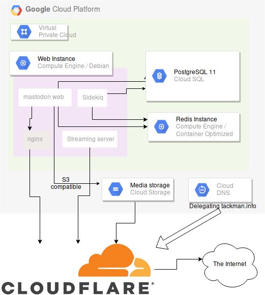

# mastodon.tackman.info の構成メモ

お一人さま用インスタンスをGCP上に立てた構成メモ。

## 構成図

## 全体

- ほぼGCPに乗せて、GCPクーポンを使って課金発生しない構成にしている
- CDNにCloudflareの無料プランを利用。SSLもCloudflare任せ
  - Cloudflareに乗せるため、tackman.info のネームサーバはCloudflareを利用

GCPは特記がなければ全て us-west1 (オレゴン)で動かしている。

## 構成

### Compute Engine

- Web Instance
  - g1-small 1vCPU / v1.7GV 価格は月額$13程度、確約利用割引を使えば$5程度まで落とせる
  - Docker / docker-compose でmastodon公式イメージを動かしている
  - PoostgreSQLとRedisは別インスタンスにしてあるので、公式 docker-compose からこれらをコメントアウトして起動
  - コンテナネイティブな環境にしたかったけど、手間がかかりそうだったので妥協して Debian でオンプレ的に動かしている
- Redis instance
  - f1-micro 1vCPU / 0.6GB オレゴンで動かしているので permanent free 枠。無料
  - Compute Engine の container optimized OS で Redis 公式イメージを動かすだけのお手軽枠

### Cloud SQL

- PostgreSQL 11(β)を使用
  - もともと動かしていたherokuのPostgreSQLのバージョンが10系で、9.6だとdumpが読めなかったのでβが取れていない11を採用
- db-f1-micro 0.6GB 月額$8程度
  - [Google SLA対象外だから本番で使うな](https://cloud.google.com/sql/sla)と明記されている。お一人さまインスタンスなので自己責任で利用
  - お一人さま用だとこの性能でも余裕がある

### Cloud Storage

S3互換APIがあるので、S3互換のAPIキー発行 → mastodon側でS3を利用する設定でそのまま使える

#### ハマりどころ

Cloudflare側の制約で、ドメイン名がトップレベルから1段下までしか面倒を見てくれない。

例：
- media.mastodon.tackman.info -> NG
- media-mastodon.tackman.info -> OK

原因が分かった時はさすがに「知るかこんなもん！」と叫んだ。

### Cloud DNS

- 今回はドメイン名取得に利用しているだけ

### Cloudflare

- 個人で使えて、無料プランで容量無制限の貧乏人の味方
- SSLの面倒も見てくれる
  - mastodon公式チュートリアルがやってるようなLet's encryptの設定などから解される
- Webサーバ、Cloud Storageの静的ホスティングそれぞれの前に置く構成