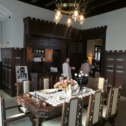
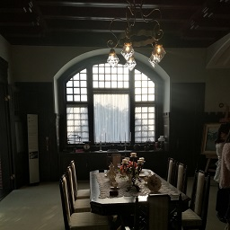
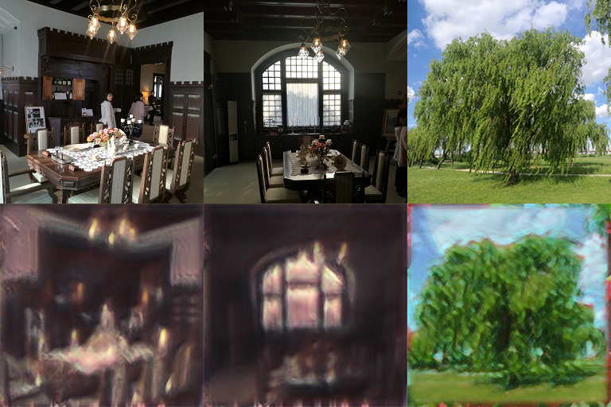

# アートワーク制作手法の中間報告

## コミティア新刊の進捗報告を兼ねて

### モチ回 第2回 2020.01.25 tackman

---

# 目次

- SinGANを利用した画風変換
- ドールのトレスで人物画が作れるか
- コミティア出展します
  
---

# SinGANの概要

## GAN（敵対的生成ネットワーク）の一種

- 元祖GAN誕生から5年以上、すごい勢いで改善やバリアントが発明された
- 近年の深層学習での画像や音楽などの生成の8割以上はこれと思っていい
  - ex. Waifu Labs, Style2Paints

## one shot learning

- 通常GANにはそれなりの枚数の学習データが必要
  - 目的によるが、画像変換で最低数百枚・ノイズからの生成なら数十万以上
  - 学習時間もそれなりに良いマシンで1週間とか2週間とか
- が、SinGANは画像1枚から学習する！
  - 1枚2時間ほどで学習完了する

---

# SinGANの能力の利用：Harmonization

## 原著者らによるHarmonization

- 「雑コラを自動的に丁寧コラにする程度の能力」
  - 口で説明するより公式実装のデモを見てもらった方が早い

## Harmonizationを利用して画像変換

- 元画像全体にHarmonizationを適用して、画風変換として利用する
- 実写 → 背景画・コンセプトアート風への変換を意図

---

# 実例

   

---

# ドールのトレスによる人物画制作

## 動機

- トレスにする理由は非絵描きで絵筆を取ったことがある人には自明なので略
- 2010年代の結果として、イラストの顔立ちとフィギュア・ドールの顔立ちが接近してる
- Waifu Labsじゃいかんのか？
  - 横顔を量産したいという需要があった
  - まだWaifu Labsは「いかにも」Waifu Labsな画像が出る
  - seedガチャが辛く、思った感じの子を作るのは不可能に近い場合がある
  - 半世代ほど遅れた絵柄になりがち
    - 恐らくデータセットが原因
    - この手の事例で使われるデータセットは定番Danbooru 201Xシリーズくらいなので、多少手法を変えても同じような結果になりそう

---

# 結果

## イージーな手法としては使えない

### 横顔、斜めアングルだとトレスじゃ可愛くならない

- ドール自体正面まわりのアングルで一番可愛くなるように作られている
- イラストでは横や斜めは可愛くするために盛大に「嘘」があるが、トレスだと嘘をつかない
- 「横顔があんまり可愛くない3Dモデル」程度にはなる
  - が、スクラッチで自分で描いた方がまだ可愛かった

それでもポージング人形よりは楽しく使えるので、全体構図づくりなどには使えそう

---

# その他の制約

- イラスト資料専用に買うにはコスパが悪い（自明）
  - ドール趣味者がついでにやるならお得、というレベル
  - 資料用にするなら1/3サイズのものが欲しいが、高くてデカい
  - ただしお洋服は様々なバリエーションがあり、手で触って確認できるのは他媒体にない利点
- ポーズに制約がある
  - 人間より関節の可動域がかなり狭い
  - 重力の制約を受ける

---

# コミティア131に出展します

- 2020.2.9 東京ビックサイト「O41b 世界革命研究所」
- 「ボードゲームのアートワーク制作手法本(仮)」の新刊予定
- 進捗は？
  - 本文0ページ。ガハハ！ｗ
  - 書く内容はこのスライドにあるように蓄積してるので・・・

## その他のコミティア新刊内容予定

- ぼかしとエフェクトでエモそうな表紙を作る
- Unityを利用した即席アートワーク
  - どちらも百合紅での制作事例からのまとめ
  - Unity利用の方は大昔の技術書典向けにコピ本で書いた記事の再録予定

---

# 参考文献

1. SinGAN 原著者らによる公式実装 https://github.com/tamarott/SinGAN
1. Waifu Labs https://waifulabs.com/
2. Style2Paints https://style2paints.github.io/
3. Danbooruデータセット 2019年版 https://www.gwern.net/Danbooru2019