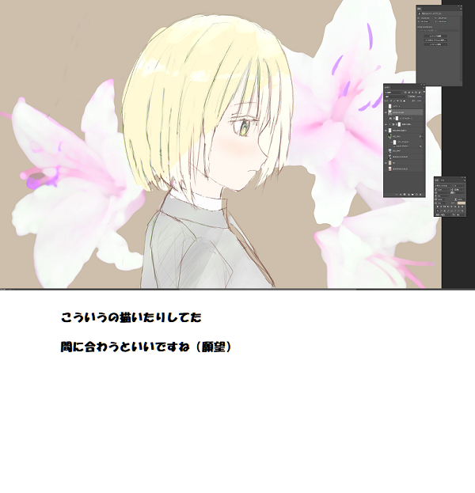

# 次回予告集

## モチ会 第3回 
### 2020.02.01 tackman

---

# どういうことなの

- コミティアとか原稿やってた
- 「アートワーク手法」の枠で試行錯誤して、半端な状態の調査事項がいっぱいできた

今回はキーワードだけ羅列して、次回どれかをネタに知見をしゃべります

---

# 次回予告集

## react-three-fiber

React的なコンポーネントでThree.jsを書けるやつ

## GPU利用状況監視のログ基盤

調査中。Elastic-stack使うのが一番丸そう、ほんまか？

## 色空間の話

簡単でいいから画像の色成分分析機を作ろうとしたら思いの外沼だった

## NURBS

曲面を描こうとした時ついでに調べた。結果的に使わないかも

---

# コミティア本進捗

---

# 参考文献

- react-three-fiber https://alligator.io/react/react-with-threejs/
- Elastic-stack https://www.elastic.co/jp/elastic-stack