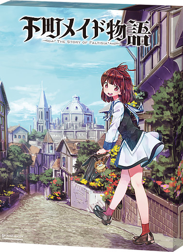

# ボドゲ温泉合宿報告

## 2020.02.29 モチ会 第5回

### tackman

---

# 目次

## ボドゲ温泉合宿とは

## プレイしたゲームハイライト

## 進捗へのフィードバック

---

# ボドゲ温泉合宿とは！

- 2014年から毎年のように開かれている
- 2泊3日、温泉地に行って観光に目もくれずボドゲばかりやる
- 元Civ4マルチ勢などがコアだったので、そういう人の集まりになっている
- なんかいい酒や生ハム原木だのが無闇に持ち込まれる
  - 獺祭は前座
- 普段はやれないような激重ボードゲーム完走のチャンス！

---

# 温泉合宿ハイライト

---

---

# トワイライトインペリウム　概要

- スペオペモノ。ボードゲームでやるStellarisマルチ
- 内政要素は多すぎず少なすぎず
  - 手番とキャッシュの投入先と、技術ルートを選ぶ経済
- 6人プレイでインスト2時間、プレイ時間8時間（実績）
  - インスト/GM役が冗長で、酒飲んで遅くなってる人がいたせいは大きい
  - 4人プレイなら4時間で終わると思います、CivBG並
  - 温泉合宿でもないとなかなかやれない
- プレイ感はCivilization the Board Gameにかなり近い
- MegaCivほどダレない、理不尽な交渉やガチャゲーではない

---

# トワイライトインペリウム　ルールピックアップ

## 勝利条件

- 何かの条件を満たすと1点が入る
  - 共通目的の達成、個人目的の達成
  - 銀河の中心星を押さえていると確実に1点もらえたりする
- 誰かが10点になった瞬間ゲームセット（カタンと同様）
- 1ラウンドに最大2点しか獲得できない！
- 首都星系が占領されているとVP獲得ができない

点数方式だけど、クエスト達成型×Nのゲームデザイン

---

---

---

# 下町メイド物語

---

# 下町メイド 概要

- メイド候補生になって学園に通う
  - 学園モノですよ！
  - 「卒業要件」もある
- ドラフトで保持アクションカードを決める
- 講義・アクションカード・野外活動の3択×ターン数
- バッティングでのアクション選択式
- 講義をサボってバイト三昧してメイド仮免取得したりする

---

# 下町メイド ルールピックアップ

- 手番数は完全固定制
  - 早期終了も引き伸ばしもなし
- メイドの身につけた能力やアクションカードごとにVPがある
- VPの総合点で勝負
  - 参考：初プレイ同士で1位が79点、2位が77点

---

# 進捗へのフィードバック

---

# 進捗 #とは

- 新作百合ボドゲをぼちぼち作っています
- 経済モジュールはだいたいこんなもんでしょ、になってる
- 勝利点モジュールの形が今ひとつ「これだ」というのがなかった

温泉合宿でやったゲームで、勝利点モジュールの方向性が見えた

---

# 勝利条件とギャハハ度

ギャハハ度とは： ”プレイしていて思わずギャーッとか声をあげちゃう度合い”

## 勝利条件による違い

- 条件達成型 → 高いギャハハ度
  -  CivBG イノベーション カタン トワイライトインペリウム 4Exploits 百合紅
- 点数競争型 → 低いギャハハ度
  - ドミニオン アグリコラ シンデレラのおしごと 下町メイド物語
  - 下位分類：
    - 手番数固定型 → 低いギャハハ度
      - Wingspan
    - 早期終了あり → 高いギャハハ度
      - テラフォーミングマーズ

---

# で、どうするべきか

- ギャハハ度の高い低い自体に優劣はない
- その上で、今回は高いギャハハ度の選択が合いそう

 条件達成で勝者が決まる方向でまとめる

---

# 緩募

トワイライトインペリウムを4人くらいでやってくれる人。
自宅に実物コンポネあり、オンラインも可！

---

# 参考文献

- スパ帝国 ルールデザインノート https://gumroad.com/l/QBfY
- 下町メイド物語 https://www.laughsketch.co.jp/shitamachi-maid
- トワイライトインペリウム https://www.fantasyflightgames.com/en/products/twilight-imperium-fourth-edition/