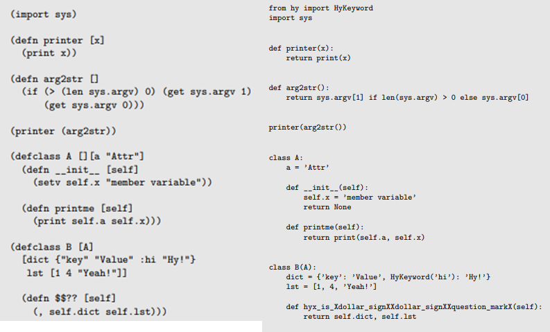

# Hyショートイントロブックの紹介

### 技術書典8のはずだったんだよの巻

## 2020.03.07 モチ会 8回

### tackma

---

# 目次

- Hyと日本Hyユーザー会活動の紹介
- 今週やったこと

---

# 時事

### 新型コロナウイルスの影響で、技術書典8が中止になってしまった！

- Hyショートイントロブック v1.1は技術書典8で頒布予定だった
- モノはあるのでオンラインで電子版頒布します

---

# Hyショートイントロブックとは

- プログラミング言語 Hy というものがあります
- Hy入門者向けの薄い本
- 技術書典7から「日本Hyユーザー会」を名乗って参加・頒布しています

---

---

# Hy本の頒布について

### ドマイナーな言語なこともあり、電子版無料配布

- 本物のLisp-erを呼び出す召喚陣にしたかった
- Hyの情報は私も欲しいんだよ！！

---

# プログラミング言語Hyの紹介

## 「Pythonランタイムで動くLisp方言」

- 言語の構文自体はLisp
- （概念的には）Pythonにトランスパイルされて実行される
  - 実際にはバイトコードを直接吐くので、正確にはPythonそのものに変換しているわけではない

## Pythonとの完璧に近い対応関係あり → Pythonの資産を全て利用できる！

- Pythonの豊富なライブラリ群を、Lispから自然に扱える！
  - 数値計算にnumpy
  - 深層学習にPyTorch
  - スクレイピングにBeautifulSoup etc

---

# Hyのコード例 with ロゼッタストーン

---

# Pythonより有利な点はないの？

## マクロ！

HyもれっきとしたLispの一族なので、(Lispの)マクロが使えます

## （Hyを含む）Lispのマクロの強烈な能力例

- 実行時に行える任意の計算はマクロでできます
  - というか関数とマクロの区別は、計算されるタイミング以外は曖昧
- コンパイラのパーサを書き換えたりできます
  - Lisp処理系で動くどんな奇天烈な見た目のDSLも作り放題

---

# 今週やったこと

## Hy本の改訂版 v1.1 をリリースしました

- 内容的には第1版第2刷的なもの
- BOOTHにはアップロード済み
- 技術書典応援祭にはこれから登録します

---

# 告知

## Hyショートイントロブック、BOOTHで頒布中！

### https://tackman.booth.pm/items/1570502

---

# リンク＆参考文献

- 日本Hyユーザー会 http://hyjp.org/
- Hy https://docs.hylang.org/en/stable/
- On Lisp [Paul Graham, 野田開 訳 2007]
- https://blog.techbookfest.org/2020/02/28/cheering-tbf/
