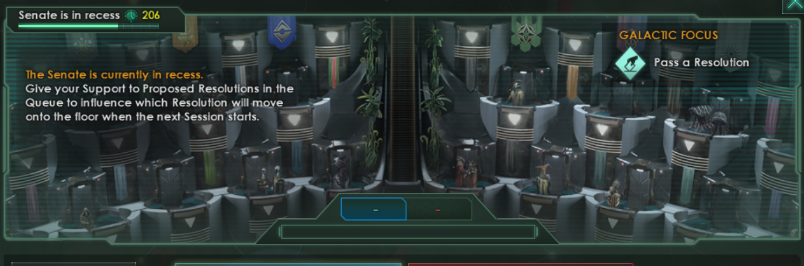

# 進捗報告の会

## 2020.03.28 モチ会 11回

### tackman

---

# 進捗

## StyleGAN2実装進めてた

- ☑関連論文も含めてペーパーの内容完全に読み込んだ
- ☑アルゴリズムのPythonコードレベルでの実装した
- ☑フレームワークやIOまわりの実装した
- ☐細かいバグ取り

明日は低温大雪の予報なので、自宅GPUサーバ（だんぼう）回すのに間に合わせたい

---

# 何やってたの

- その…Stellarisを…
- 今週はStellaris絶ちした瞬間から進捗が生え出した

Steamのプレイ時間を見ると、ver2.6リリースから一週間で30時間ほどプレイしていたみたいだけど、多分Steamのバグだと思う

---

# 祝Stellaris 2.6 / DLC Federations 発売！

https://www.youtube.com/watch?v=zL0kemiI0yc&feature=youtu.be

以下現行バージョンのStellarisについて語ります

---

# Stellarisとは（全バージョン共通）

- Paradox社の手がける宇宙4X
  - Hearts of Ironとか作ってるところ
- 初心者バイバイと評判のパラドゲーの中では極めて入門者にやさしい
- モチーフはスペオペ・銀河帝国
  - 歴史知識がないとノリにくいEuropa UniversalisやHearts of Ironに比べて敷居は低いと思います
  - スター・ウォーズや銀河英雄伝説に由来するあれこれもあったりする（次スライド）
- コミュニティ翻訳の日本語化は毎回リリースとほぼ同時に提供されるので、英語苦手ニキにも安心

---

---

# こんなプレイをしたい人におすすめ

- 200年かけて育てた帝国の総力をつぎ込んだ艦隊を、たった一回の会戦で溶かしたい！
- 艦隊を作りすぎてエネルギーが足りない！早く開戦して艦隊を溶かさなきゃ・・・
- HoIではできないホ○コースト異種族浄化プレイをしたい！
- ちまちまリソースを最適化して圧倒的内政をしたい！
- 外宇宙の侵略者相手に、絶望的な防衛戦を戦いたい！
- 未知との遭遇をしたい！
  - シナリオパックでRPG的な楽しみもあります

---

# Stellaris 1 → 2での変更

## 内政が抜本的に変わった

- 1.xでは内政は大味で、とにかく領土を広げる・ヘルスタック艦隊を作る・敵を殴るといったゲームだった
- 2.xでは帝国の内情シミュレーターとしての解像度が上がった

---

# 2.xでの内政

- POPが労働者・専門職・支配階層に分化
  - 上の階級ほど多量の資源・消費財を使ってより高出力
- 惑星ごとに得意不得意が設定される
  - よって自然と星系間の水平分業が進む
- 内政に奥行きができた結果、最適化の余地が広がりやりようによってすごい出力を出せたりする
  - 一方で分業でより帝国が脆弱にもなる
  - 資源惑星を失った官僚特化惑星や、労働者階級が減った時の専門職・支配層の悲惨さは・・・
    - アシモフ「ファウンデーション」の世界
    - ピーター・ターチンの永年サイクルが再現されているゲーム

---

# 2.6 での新要素

# 銀河評議会

- Civ4の国連みたいに色々えげつないことが起こる
- 絵面が完全に銀河共和国元老院

---

# 参考文献

- アイザック・アシモフ「ファウンデーション」
- ピーター・ターチン「国家興亡の方程式　歴史に対する数学的アプローチ」