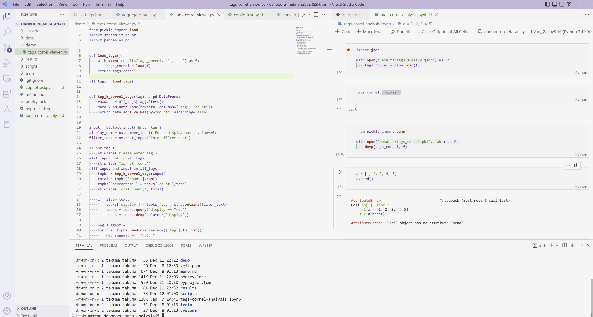

# 今回やったこと

## 2023.01.07 モチ会 100 回

### tackman

---

# 日記系

- 確定申告の季節になったので、choubo.js（オレオレ帳簿アプリ）の構成見直し
- 画像生成AIで何やるか考えたりした
  - 追加学習系であれ、アプリケーション開発でこれみたいな
    - GPU暖房になるので追加学習系はなるはやで回したいところ
- データセット置き場用に16TB HDD増設したりした
  - 既存の6TB HDDの使用率が97%とかになったので
- Spiel'23の日程妄想したりした
  - 凱旋門賞を見た足でEssen Spielに行くことは確定

---

# 最近のコーディング

## 全部VSCode remoteで良かったんや

- VSCode リモートssh接続でローカルのディレクトリを開いているのと変わらない
- ホスト側のcode serverセットアップを全自動でやってくれる（！！）
- 自宅GPUサーバにVSCode+sshで繋いで画像生成関連のあれこれやれている

---

# サーバレスRDSを探した話

### 背景

- 現状のchoubo.jsバックエンドはFirebase/Firestoreにべったり
  - フロントは一応Next.js
- skebのherokuからの光速脱出劇を見て、ポータビリティ高い構成にするべきだと思った
  - Firestoreへの依存を無くしたい
- 一方で自前でDBサーバ管理はしたくない、常時立ち上げ系も費用面でやりたくない

SupabaseとPlanetScaleを候補に調べた

- 他だとAWS Aurora Serverless+Postgresは有力そう

---

# Supabase / PlanetScale

- 共通：マネージドRDSのホスティング＆無料枠あり
- Spabase
  - DBはPostgres
  - DB以外も色々あって、Firebase代替OSSウェアという感じ
  - 昔の記事で無料枠は一定期間未使用でデータ削除とか書いてあった
- PlanetScale
  - DBはMySQL
  - 本番使用も許されそうな無料枠
    - デイリーでバックアップも取ってくれる
  - サーバレスDBの提供自体を中心にしてそう

---

# さしあたり行くならPlanetScaleかなとなったところで

- ORMはprismaでいいよねとか考えてた
- が、Firestoreと違ってDBアクセスするにもWeb(API)サーバーは必須
  - それはそう
  - Next.jsのAPI RouteをCloud Runに載せなきゃになる
- 現代Web開発の芋づるミーム状態になってきたので一旦切り上げ