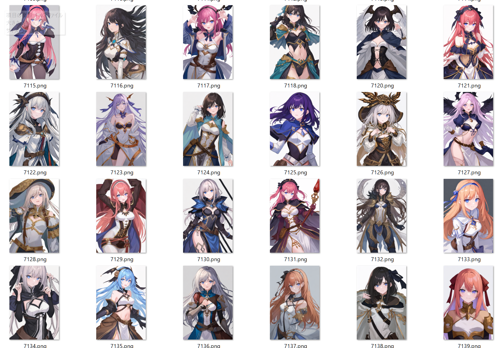

# 今回やったこと

## 2023.02.11 モチ会 101 回

### tackman

---

# 日記

- 個人プロジェクトをゆるゆる始めた
  - 成果を出すまで秘匿する枠
  - 3末で暇になるので、そこからスパートできるように走り始め
  - 技術スタック選定、なんだかんだで過去にモチ会で発表したやつになってる
- Twitterからの移住先をつらつら考えている、が結論はなかなか出ない
  - ActivityPub対応したいところだけど、地味にハードルはある
  - UIだけだとMisskeyは良さげだけど、スケールさせるの大変そう
    - https://misskey.io/notes/9b0ht33ds3 
  - 今年いっぱいくらいでゆるゆるやる予定
- 女の子キャラカード200枚でやるゲーム考えた
- ↑のゲームで使う前提で女の子画像1万枚くらい生成した

---

# StableDiffusion WebUIで1万枚生成

- 野良モデル+モデルマージに手を出した
  - WebUI(AUTOMATIC1111)にモデルマージ機能はあり、ボタンぽちぽちで可能
- WebUIにはAPIモードがあり、大量生成の自動化が可能
- 金曜の大寒波でGPUを回し続けて暖を取れた

---

ファンタジーモチーフを想定しているのでモチーフを寄せています



---

# AIお絵描きのトレンド

移り変わりは激しいので私も現状を把握しきれている自信はないです

- 野良モデル+モデルマージで自分の出したい方向性のモデルを作って量産
  - モデルは https://civitai.com/ などから物色できる
  - 野良モデルはHypernetwork等で追加学習したものが多い
- NovelAIDiffusionに比べて多様性は落ちるが、その分量産はしやすい
  - 毎時投稿してるようなAIイラストアカウントはほぼこうしてるはず
  - 品質が安定しているので元素法典的な複雑呪文は不要

```
best quality, 1girl,  porrait,  white background, simple eyes, fantasy, medium breasts

neg: 3d, low quality, hair ornament, kemomimi, weapon, backlighting,   ((loli)), gigantic breasts,  huge breasts
```

---


---

