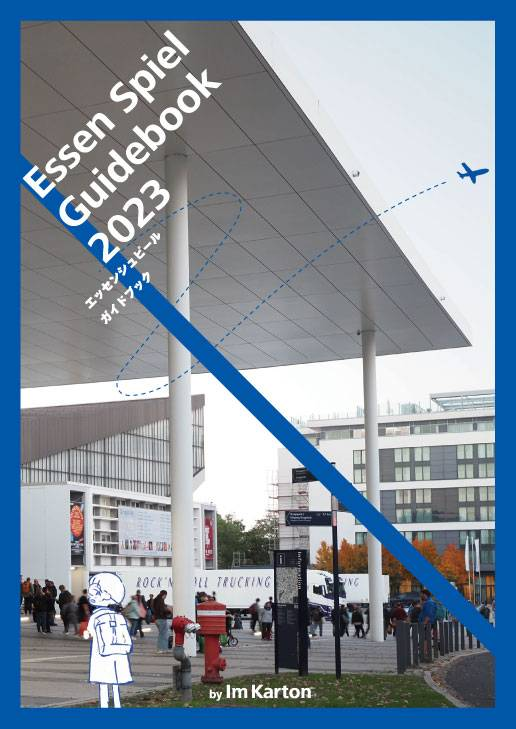

# 今回やったこと

## 2023.08.19 モチ会 102 回

### tackman

---

# 半年分くらいの産業まとめ

- Essen Spiel本をお友達と一緒に出した
- Fediverse移住を決意した
- ゲーム作り始めた
- GenCon行ってきた

---

# Essen Spiel本

- 世界最大級ボードゲーム展示即売会・一般参加の手引書
- フルカラー78pの異常な本になった
- 無事初版完売したので次版予約中
https://imkarton.booth.pm/items/4958519

---

# Fediverse移住を決意

- 7月にTwitter(当時)がいわゆるAPI制限で公式クライアントすら使えなくなったのが決定打
- さしあたり misskey.io を日常＆趣味系の話をする場にしてる
  - チャンネル（mixiのコミュみたいなもの）で競馬の話したり
- それとは別に自前ActivityPubサーバーの必要性を痛感したので真面目に製作開始
  - 自分で実装全部分かっているサーバーでないとﾀﾞﾒﾀﾞﾅと悟り
    - mastodonやmisskeyはお一人様で立てるのがつらみがあるのも

一昔前は自分でブログやActivityPubサーバー実装は趣味盆栽の扱いだったけど、実用的な意味合いが強くなってしまった（時代が悪い）

---

# 新作ボードゲーム作り始めた

割りといつも思いついては流産をしていますが、「海外市場を取りに行く」「Essen Spielに殴り込む」という目標が出来たため本格的にやることに決意しました

- 円安がすごくて海外市場を狙う意味が上がってきた
  - 消費の時代は終わり、生産の時間だ！
- 百合紅より一桁多い売上を狙いたい

---

# GenCon行ってきた

- USA最大のアナログゲームの祭典
  - 実は規模的にはEssen Spielと同格のデカさだった（行って判明）
  - 起源がコミュニティミーティングのため、Spielよりコミケっぽいかも
- インディアナポリスという割と何もない地方都市で開催される
  - Indy500は有名だけど、それ以外で日本人が観光しに行くことは…
    - 入国審査で「何しに行くの？」って突っ込まれた

---

# GenConの雰囲気

- アナログゲーム総合という性格が強く、ボードゲームはEssen Spielの1/4くらい
  - Essen Spielは会場全域がボードゲームだけど、GenConはいろいろ
    - 起源がD&D（TPRG）にあったから？
- よりポップカルチャーのオタク文化寄り
  - Essen Spielより日本系コンテンツ文化が幅をきかせていた
- あらゆるものが虹色に光る
  - レインボーフラッグ的な意味合いから単に虹色にしたいだけなものまで

「妹再生産を持ち込むならGenCon」「4Exを持ち込むならEssen Spiel」という印象

小冊子の写真集作ったので、イベントやオフで配ろうと思います