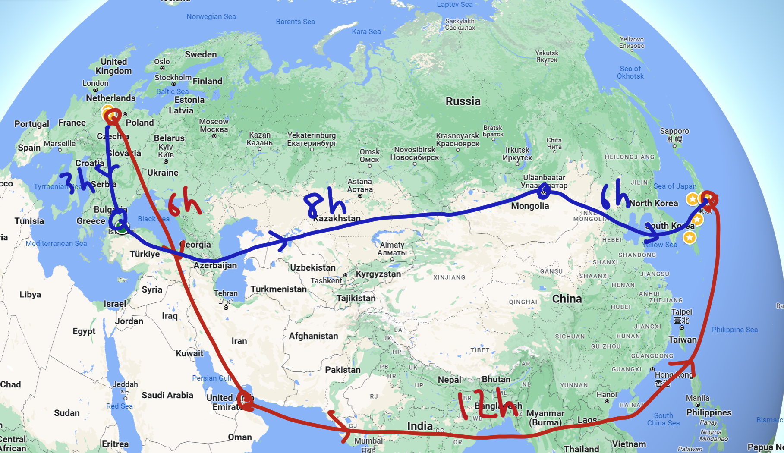
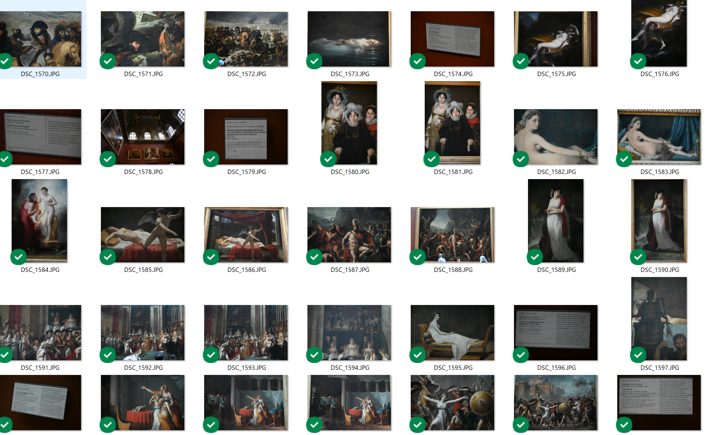

# 外貨稼ぎたい

### SPIEL & 欧州訪問まとめ回

## 2023.10.21 モチ会 103 回

### tackman

---

# 半月ほど欧州に行っていました

1. 凱旋門賞(10/1)に合わせてパリへ
2. 間の日程をバルセロナで潰す
3. SPIEL Essen (10/5-8) 今回の主目的
4. イスタンブールで4日ほど帰国便までを過ごす

---

# 欧州限界旅程情報①

## 凱旋門賞とSPIEL Essenは一週間違い

- 一度の渡欧で両方行ける
- パリ-エッセン間は鉄路充実、かつ結構安く移動できる

凱旋門賞以外にもパリコレ、ミュンヘンのオクトーバーフェストがこの時期

---

# 欧州限界旅程情報②
## ドイツ～東京 ≒ ドイツ～イスタンブール + イスタンブール～東京

- 飛行機代に関して上記の定理が成立する
  - 時期を選べばイスタンブール経由の方が安くなるまでありえそう
- 総フライト時間もちょっと短くなる

---

# イスタンブール経由のメリット

- 同じ飛行機代でイスタンブールに寄れる
  - イスタンブールは物価が安いので、滞在費は知れている
    - パリにいたりするとスリップダメージが大きい…
- 一度のフライト時間の上限を抑えられる
  - フライト疲れは4時間を超えたあたりから非線形に増大する持論
  - 12時間フライトの疲れ >> 8時間+4時間のフライト

---

# イスタンブールって滞在して嬉しいの？

「三方を海に囲まれた坂道の街。猫がいっぱいで昔ながらのバザールや寺社（モスク）から、近未来的なタワーまであるきらら漫画の舞台みたいな街」

- 魅力：歴史も猫も飯もあります。書ききれないのでブログ書いてる
- ご飯：特徴的ではあるけれどそこまで人は選ばない。辛くもない
- 治安：USAやパリの方がよほど終わってる
- 清潔性：それなり。海外の中ではかなりきれいな部類
- 物価：圧倒的に安い！！
  - トルコが欧州の衣料品になっているようで、異様に安くて品質が良い服が
- 人心：おだやか
  - 街中にいる猫の効果？（街全体が天然猫カフェ状態） 
  - 猫は人になついてくる、その辺に子猫がいるし授乳もする、人も餌をあげる
- 政治リスク：流石にゼロとは言えない（完全な自由国との比較）
  - うっかり勾留されるリスクはシンガポールよりは低そう

---

# イスタンブール猫

https://twitter.com/tackman/status/1712584496737067504
https://twitter.com/tackman/status/1711792973124456710
https://misskey.io/notes/9l0y3kbbia

---

# 凱旋門賞レポート

スルーセブンシーズが4着までだったので遊ぶ金無くした

## 当日のアクセスと入場

- 入場券はオンライン販売。ゴール前立見席で€70くらいする
- 最寄りメトロ駅から競馬場入り口は数kmあるけれど、無料送迎バスあり
  - なお渋滞に巻き込まれる模様

バスの車窓から見えるブローニュの森、本当に森

---

# ロンシャン競馬場

- ピカピカ。黄色系の塗装をしているのも合わせてピカピカしてる
  - 「世界一美しい競馬場」はフカシではないなと感じました
- スタンドの規模感は意外にもローカル競馬場並
  - 総合的ゴージャス度で言えば贔屓目抜きで府中が上だと思う
  - 大きすぎて移動が大変な東京競馬場より過ごしやすさは上
  - パドック、近い
- 一年一番のお祭り日だけど、人混みはほどほど
  - ゴール前に陣取れる程度には空いてる、かといって閑散でもない
    - 府中や中山のG1デイ（混みすぎ）と比べるのが間違っている説はある
  - 入場料効果？地元民がそこまで来ていないせい？
    - 英国人と日本人がやたら目立つイベントだった
      - なんだかんだ競馬狂い国は英国と日本なんだなって

---

# ロンシャン動画

https://misskey.io/notes/9kazz1i0gn
https://twitter.com/tackman/status/1708502343577165939
https://twitter.com/tackman/status/1708503259998998764

---

# ルーヴルで資料素材集めしてきた

地味に今回SPIELの次の目的でした

- 確実に自分で権利が持てる素材としての絵画写真
- ゲームで使う予定

撮影しつつざっと回るだけで1.5日消費、デカすぎる

---

# バルセロナ

地中海の日差しが馬券に負けた身を暖かくしてくれた

- ご飯：日本人の舌に合う料理体系
  - やたら日本人がやってそうな料理店が多かったのは偶然じゃないと思う
- 治安：すごく良い。街中を夜歩きしたけど新宿三丁目の方が危ない
- 物価：今のレート（1ユーロ＝160円）で東京並。安い部類

ガウディ建築見て回るつもりだったけど、サグラダ・ファミリアとカタルーニャ美術館だけ見てだらだらしちゃったのでまた来たい
https://twitter.com/tackman/status/1709258382303994361

---

# SPIEL Essen

ボードゲームの年度はSPIELで始まる。今年も行きました

## 去年との違い

- 運営主体が変わって、それに伴い良い意味で商売っ気が出てきている
  - 去年は6ホール＝入り口に雑多なブースがあったのが、今年は大手ブースがばーんと出展
  - エッセン市内でSPIELの看板を見る頻度が圧倒的に高くなった
    - というか去年は街中でSPIELの看板を見た記憶がなかった
- 地味に名前も変わって「SPIEL Essen」が正式名称になった

ホール構成など去年までの情報は本買ってね♥（ダイマ）
https://booth.pm/ja/items/4958519

