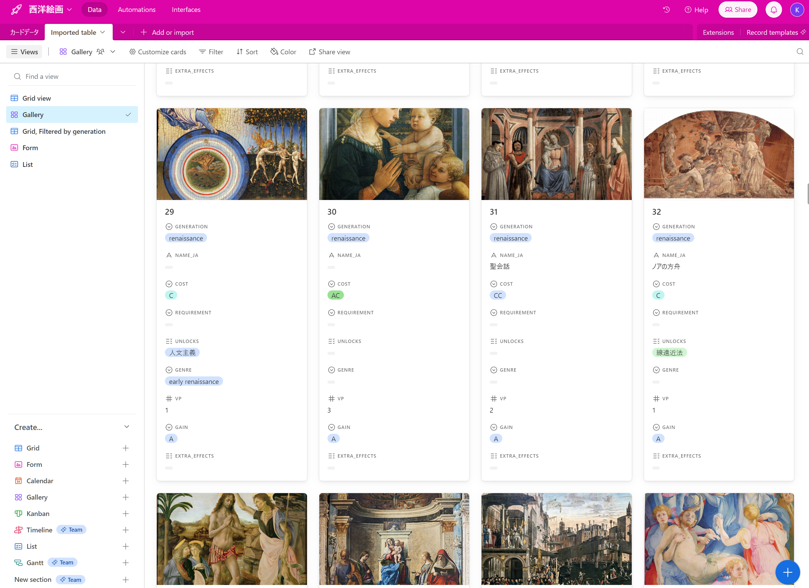

# 外貨稼ぎたい

### 今回のまとめ

## 2023.11.18 モチ会 104 回

### tackman

---

# 部屋の整理と掃除をした

- 来客駆動
- 大掃除をちゃんとしてこなかった報いを受けた
  - 同じ家に5年以上も住むのが初めてのため
    - 2年に一度の引っ越しのタイミングでどうせ強制大掃除だった
- おかげで部屋がすごくきれい＆広くなった
- 追加の家賃を払わないでも十分広いことを確認
  - リビングでボードゲームがやれる

---

# データ管理方法の整理をした

ボードゲームのデータ管理をスプレッドシートでやるのに限界を感じてAirtable導入

---

# Airtableについて

- データ管理ツール　ブラウザアプリ
- スプレッドシート的なViewの他、カレンダー・カンバン・ギャラリー・ガントチャート(有料) etc
- 入力にFormも使える
- インターフェースデザイナー(有料)もあり
  - テストプレイ用のカード印刷はこれでやれるのでは
  - → ライブデモ
- APIやスクリプト拡張も可能

もしかしたら往年のMicrosoft Accessの精神的後継なのかも
- 私自身はAccessの使用経験はないので識者の見解求む

---

# Airtableへの移行

## 実施済み
  - ゲームのマスターデータ管理
  - タスクリスト
    - 一旦Trelloを導入していたけれど、どうせAirtalbeに課金するならとで集約

## 検討中
  - 写真データ管理
    - 数千枚資料写真があり生ファイルベースの管理がつらくなってきている
  - 帳簿データ
    - 現状オレオレWebアプリで管理しているけれど、省力化して作るならフロントはAirtableの方がいい感じにできそう
      - 集計スクリプティングで泣く可能性はなくはない

---

# サークルWebサイトのホスティング整理

https://off-box.net/

- 元々tumblrに載せていたけれど、時の流れでtumblrから引き払いたくなったため
- とりあえずGitHub Pagesへ移行
  - Gitレポジトリ+静的ファイルでのホスティングがコンセプト
  - GitHub Pagesがダメになっても移行しやすくなるので第一段階として
- コンテンツの編集ツールは永遠の課題状態
  - 構成のシンプルさ・ポータビリティとチームでの扱いやすさが両立しない～
---

# サークル用にキャッシュレス決済導入した

- Square https://squareup.com/jp/ja
  - 候補は色々あったけど、最終的に寄らば外資の陰
- ボードゲームは単価が高いので現金なくても買えるメリットは大きそう
  - 今回off-boxから出る新刊は会場価格7500円 https://cherezural.off-box.net/
- VISA/Master/Amexは翌日審査完了
- アプリや機器のデキも良く今のところ不満点なし

---

# 日記

- ビジネスメールはChatGPTの方が圧倒的に上手いので、最近はもうライティングお任せ状態
- 出資馬のアンモシエラがもちの木賞（2歳1勝クラス特別競走）勝ってオープン入りしちゃった。最近の勝ち馬はデルマソトガケ(UAEダービー1着、BCクラシック2着)、クラウンプライド(UAEダービー1着など)などの出世レース！！
  - 「残り400を通過してさあ直線コース、直線コースへ向かってアンモシエラが今度は堂々先頭に立った！」でめちゃくちゃ格好いい実況もらえて嬉しい