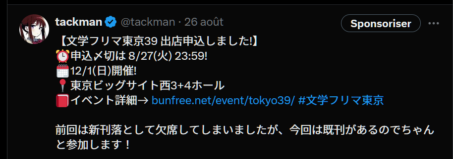

# 今回の進捗

## 2024.08.31 モチ会 113 回

### tackman

---

# 前回からのあらすじ

- Gen Con に参加してきた
- 「世界の競馬場 vol.1」出した
- 次の取材行のプラニングしてる

---

# Gen Con

- 北米最大のアナログゲームイベント
- イベント概要は一緒に行ったメンバーの記事見て（丸投げ）
  - https://www.4gamer.net/games/319/G031949/20240804003/
  - https://www.4gamer.net/games/824/G082440/20240803006/
- イベントの詳しい紹介はゲームマーケット秋で出す「Gen Con Guidebook 2025(仮)」

---

# 4Gamersライターデビューしました

https://www.4gamer.net/games/136/G013687/20240812001/

- 何枚か私の撮影した写真も採用されており、頑張ってカメラを持って行った（後述）甲斐があった

---

# Gen Con 出発前日にカメラ（Nikon Z6）が逝った

- 前日に念の為動作確認をしたら、カメラ背面ディスプレイとボタン類が死亡
  - フォーカス設定などもできないので事実上使い物にならない
- 腹をくくって、行きがけにヨドバシAkibaでカメラを買ってそのまま飛行機に飛び乗ることにした
- Nikon Z5があったのでとりあえずそれを掴んで成田へ
- 初期不良などはなく何とか取材はこなせた
  - カメラを箱ごと運びながら日本とインディアナポリスを往復する実績
- 一方で短期間とは言え使い込んだ結果、Z5への不満が結構湧いてきた
  - AFが弱い、暗がりに弱い…
  - 次の取材行までにカメラ買い替えたい（財布に悪い）

---

# 「世界の競馬場 vol.1」完成した

- 本当は5月の文フリで出す予定だった
- なんとかコミティア合わせで刊行
- 雑誌風レイアウトに挑戦してめちゃくちゃ大変だと分かった
  - 文章の書き方も普通の本とは勝手が違うという学び
  - 最終的には割り付けしたInDesign上で直接テキスト編集始めた

---

# 本の宣伝

- メロンブックス https://www.melonbooks.co.jp/detail/detail.php?product_id=2491624
- https://tackman.booth.pm/items/5803665

---

# 今後の予定と候補

- **確定済** 09.20-22 Taiwan Original Board Game Expo (TOBE)
  - off-boxとして出展
- **確定済** 10月前半　SPIE Essenとついでに欧州周遊
  - 予定訪問地：サイゴン・アルザス/コルマール・アーヘン・エッセン・ベルリン・プラハ・イスタンブール
    - アルザス地方は「ご注文はうさぎですか？」のロケ地
- [候補] 11/4 JBC佐賀競馬場（ついでに鹿児島熊本も行きたい）
- **確定済** 11/16-17 ゲームマーケット秋（幕張）
- [候補] 11/22-24 Asia Board Game Festival in Singapore
- [候補] 12/8 香港国際競走（シャティン競馬場）
- [候補] 2025/2/22 サウジカップ（リヤド）
- **確定済** 2/28-3/2 FIJ Cannes
  - FIJへの行きがけにリヤドに寄るプラン