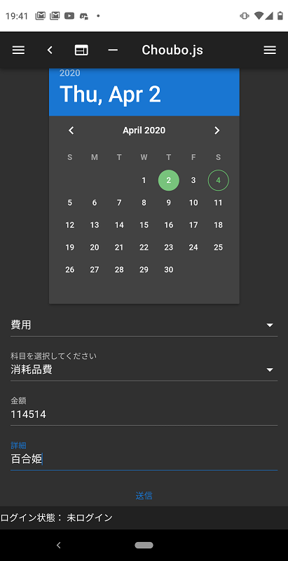

# 確定申告

## 2020.04.04 モチ会 12回

### tackman

---

# 確定申告の進捗

- 自作ツールにより、費用計算は最初から終わっている
  - この後紹介します
- TODO
  - 売上計上
    - こちらはツールに乗せてなかった
    - かなり効率差が出ているのを感じるので、今期はシステム化するぞ
  - 一部商品の貸し倒れ金扱いにするやつの処理
    - 個人経営ボドゲショップ、音信不通になる例が多い
    - 最初から営業費用扱いで寄贈の方がいいかもしれない

---

---

# 費用入力ツールchoubo.js

- シンプルに費用入力だけするためのWebアプリ
- 2019年の頭から制作・運用
- なんだかんだで1年使い続けて、2019年分の費用入力は全部できてた

---

# 技術スタック

- Vue/Nuxt.js
  - PWA化を簡単にできる点を評価
    - Progressive Web Apps
    - スマホアプリ的な利用感を簡単に得られる
  - 当時はReactにHooksがなかったので、Vue/Nuxtのイージーさの相対アドが大きかった
- Firebase / Firestore
  - 認証まわりで丸投げできるのは本当に楽
  - DB設計はRDBと同じくらいは真面目にやらないとダメです
  - お仕事でちょっとしたWebアプリ作る必要があった時に最速で組めて最高だった

---

# （クラウド会計ソフトじゃ）いかんのですか

## 個人事業主には牛刀感があった

- 気の利いた機能は有償のものが多い
- 会社クレカの存在を前提にしているUX
- 細い分類いろいろ設定できるけど、そこまで分けるのが面倒

「個人事業主が確定申告で楽をしたい」というユースケースには微妙にマッチしてなかった

---

# 残タスクと課題

- 売上まわりを手動で…やるのか…？
- 即席売上入力＆集計ツールを作るかもしれない

---

# 毎年一つ改善

- 去年一番面倒だった費用集計をシステム化した
- 次に面倒だった売上管理が一番面倒になった

一番面倒なところを確定申告ごとに潰していきたい

# 参考文献

- PWAs https://developer.mozilla.org/en-US/docs/Web/Progressive_web_apps
- Firebase https://firebase.google.com/
