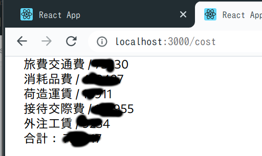
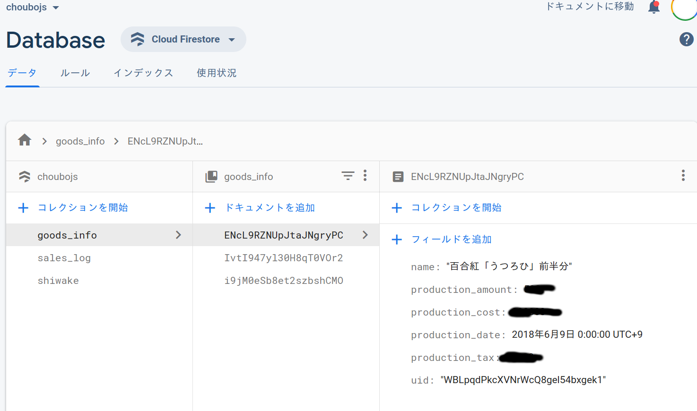
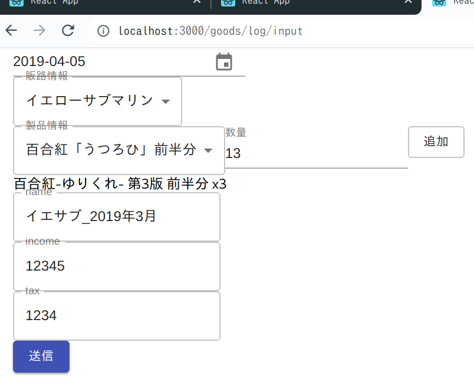
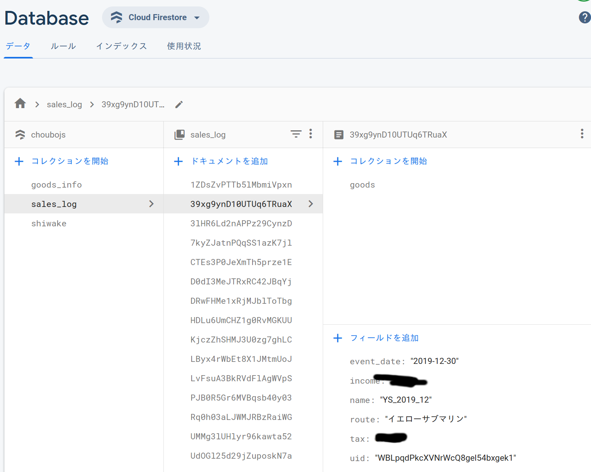

# 確定申告（事実上完了）

## 2020.04.11 モチ会 13 回

### tackman

---

---

---

---

---

---

---

---

# 補足説明

- バックエンドはいずれも Firebase
- 旧アプリは Vue / Nuxt
  - 費用入力＆確認画面だけを制作・運用（2019.01〜）
- 売上管理まわりを React(with Hooks)で急造
  - 入力回数の多い、売上記録まわりだけをフロント実装
  - 商品情報は今回はコンソールから直接作成

需要ありそうなら一般公開してもいいかもしれない
