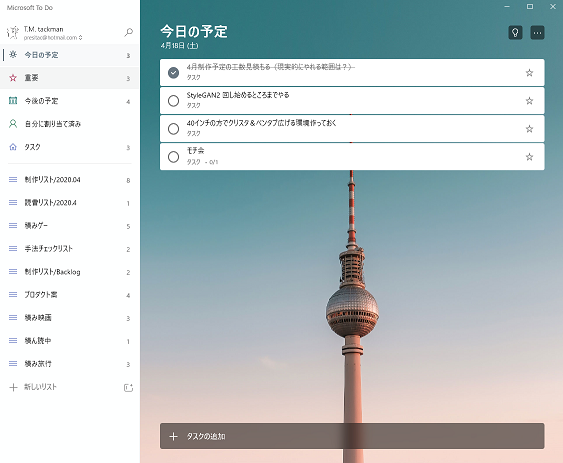

# 特にネタがないのでやったことリスト

## 2020.04.18 モチ会 14 回

### tackman

---

# 今週の作業

## ～火曜日 確定申告 提出作業

## 水～木曜日 Stellaris

丸一日時間が飛んだ。今週は1日少なく感じている

## 金～土 リハビリ

- タスクの棚卸しと、4月残りで何するかを確認した
- 遠隔ボドゲやる手法について構想したりしてみた
- 読書などをした
- 深層学習の作業再開した

---

# リハビリ期間にやったこと

---

# タスクの整理

## Microsoft To Do 導入

- Before: Todoist
  - Todoistが悪いわけではないが、チケット腐り状態
- 使い方は探ってる段階だけど、UX設計すごいいいのでは？
  - TODOツールに迷ってる人は試してみる価値ありだと思います

### 引っ越しによる片付け効果が発動

次のツールでは前世の記憶を生かしてマシな運用ができる

---

---

# 遠隔ボドゲについて

- 自粛～緊急事態続きで、ボドゲ禁断症状勢が増えてきてる
- オンラインでやってる勢もぽつぽつ観測されてる
  - でもカメラ越しでできる内容が縛れれてるぽい
  - https://twipla.jp/events/446268
- 商機を感じたのであれこれ考えてました

---

# 書籍紹介：「ディープラーニングと物理学」

- ニューラルネットの分析に物理的センスと知識で切り込んでいく
- ディープはフェイク野郎の本が多いですが、これは本物（だと思う）

元より機械学習は連続値と数値計算の世界なので、狭義のIT屋より物理屋の方がセンスを発揮しやすいのは摂理

---

# 参考文献

- Stellaris https://store.steampowered.com/app/281990/Stellaris/
  - Starter Packを買うと既存の大型拡張が揃います
- Microsoft To Do https://todo.microsoft.com/tasks/
- 「ディープラーニングと物理学」 https://bookclub.kodansha.co.jp/product?item=0000318303
