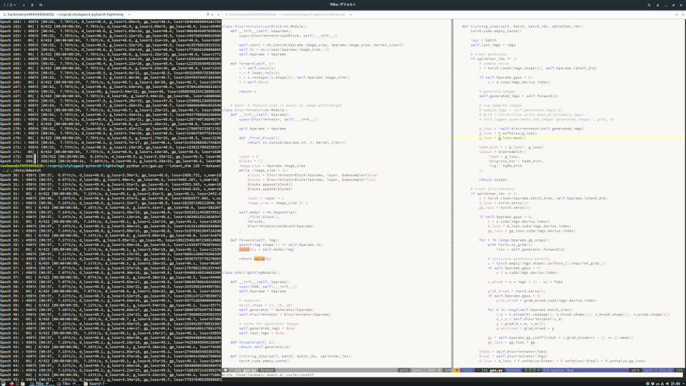

# 今週やったこと

## 2020.04.25 モチ会 15 回

### tackman

---

# 進捗

- Wingspan攻略本の原稿書いた
  - 本当はゲムマ頒布予定だったけど、コロナで順延
- StyleGAN2実装（一応）終わって回したりした
  - まだバグ残ってる雰囲気を感じる
- 力学系入門始めた
- シャニマス：ノクチル全員優勝しておいた

---

# 来週の予定

- Twitterふぁぼった画像保存ツール作る
  - 宣言駆動
  - https://twitter.com/tackman/status/1249267281051308032
- 非ディープ系画像処理手法を使って絵作りしたい
  - XDoGあたり
- 5月に労働再開しなそうなら一次創作キャラデとかするかも

---

# 書籍紹介: Hirsch, Smale, Devaney 「力学系入門」

### 動機

- 「ディープラーニングと物理学」を読んで必要性を感じた
- COVID19で流行りネタでもある（SIRモデルとか）
- ターチンしぐさ向け
  
## 雰囲気

- まだ半分弱しか読んでないけれど、解説はかなり平易
  - ストロガッツに挫折した人でも安心
- 定理の証明を完全スルーしがち、気になる人は気になるかも
  - 良くも悪くも工学系の初学者に向いている

---

# Tips: Spacemacsの紹介

---

---

# Spacemacsとは

- Emacsの拡張
  - 実態は .emacs.d/ 内のelisp群
- ベテラン各位が秘伝の.emacs.d/を使っていたような機能をパッケージング
- 原理的に普通のEmacsと共存は困難なので注意
  - Docker内で運用する場合は関係ない
- 日本Hyユーザー会推奨エディタ

---

# Spacemacsのいいところ

## 初心者にやさしい

- 困ったら Space Space してコマンドをインクリメンタルサーチでなんとかなる
  - エディタ特有のショートカット覚えるまで何もできん問題の回避
- PythonやJavaScriptなど、IDE向けに必要な機能がlayerという単位でパッケージ化されている
  - 導入は設定ファイルに一行追加
- パッケージ管理を自分でしなくていい

## 使用体験

- vim風キーバインドを選べる
- Emacsなので言うまでもなくIDE

---

# なんでSpacemacsを使ったのか

## 「VSCodeでよくない？」

- VSCodeで問題なければ、基本的にそれはそう

## Dockerコンテナ連携の都合

- VSCodeのRemote Container機能がまだ不安定
  - 立ち上げて数十分するといろいろ死んでいく
- 開発用DockerコンテナにSpacemacsをインストールする
  - エディタとバックエンド連携で細かいこと考えずに済む
- なんだかんだでCLI上で完結するのが楽なこともある
- ssh越しでも安心して使える

---

# 参考文献

- Wingspan https://stonemaiergames.com/games/wingspan/
- XDoG: An eXtended difference-of-Gaussians compendium including advanced image stylization
  -  https://www.sciencedirect.com/science/article/abs/pii/S009784931200043X
-  ピーター・ターチン「国家興亡の方程式」
   -  https://d21.co.jp/book/detail/978-4-7993-1756-3