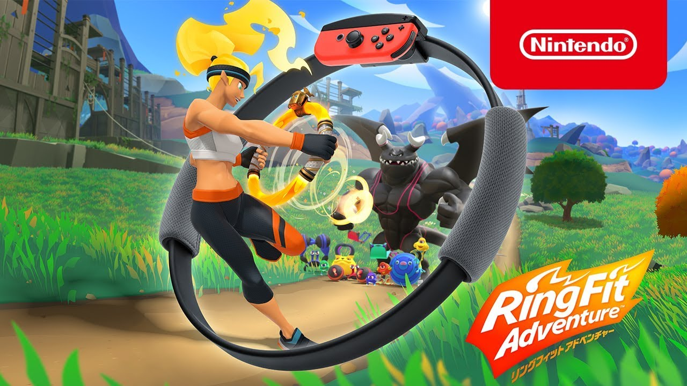

# 引きこもり生活ノウハウ紹介

## 2020.05.02 モチ会 16 回

### tackman

---

# 進捗報告

- StyleGAN2回してる
  - 上手く学習できてない
  - lossの実装がめちゃくちゃ怪しいので確認中
- ふぁば画像保存アプリ制作開始
  - 設計
  - FirebaseプロジェクトとTwitter App作成
- Stellaris 2.6/Federation 事実上完走した
- リングフィットアドベンチャーはじめました

---

# 2年以上にわたる引きこもり生活での実践

---

# 2020年、世界はコロナの炎に包まれた…

## しかし人々は自宅で労働を続けていた！

- フルリモート勤務の経験者は少ない
- 当然のように色々問題が起こる

---

# 私の経歴

## 2年以上の無職＆フルリモートのみで仕事

- ハロワ通いしてる時期も個人開発・制作はずっとしてた
- この2年以上、出社というものをしたことがない
- 家族なし、独身

---

# 今回話すこと

- 出社のない生活のノウハウ
- 開発職が出社しなくても進捗を産むための生活

## スコープ外のこと

- チームコミュニケーション
- チームマネジメントや仕事内容の評価 etc
- 対人コミュニケーション欠乏症対策
  - 私自身は年単位で誰とも話さなくても平気な方なので・・・

あくまで個人が自分の進捗を産むための手法集です

---

# 今回の話の逆をやると、そのままアンチパターンに

## アンチパターンは全部やってみた（一度はやってしまった）

「うん、これはダメだ」の実体験検証済みです

---

# 作業環境の課金のしどころ(1)

## 自宅

- 身も蓋もなさすぎて目を背ける人が多いけれど、最重要
- 地価の高いキラキラエリアに住むのは相応のディスアドを覚悟すべき
  - 打ち合わせ含めて一切出社不要なら北海道や島根などがいい
  - 私の場合は営業活動の都合も加味して足立区在住
- 自宅に投資しなからスタバの方がはかどるなんてことになる
  - サ店代でもっと広い家に入居しよう

---

# 作業環境の課金のしどころ(2)

#### よく言われる系

- インターネット回線
  - IPv6/IPoEがないと人権喪失
- （自前の場合）パーソナルコンピュータ＆周辺機器
  - 持ち歩かないんだから重くても性能が高い方がいい
  - デスクトップが理想、MBP縛りならMPB15
- 椅子

資本主義全開ですが、これら投資がしょぼいと何やっても上手く行きません

---

# 布団から出る。服を着る

- 出社しなくても「勤務時間」ということを身体に刻む
  - 自主制作でも同様
- この点でも布団から触れないデスクトップの方が良い

---

# セルフ朝会/夕会

会にする必要はないけれど、

- 今日の作業計画
- 今日の進捗

を自分で認識はできないとマズい

- 進捗を詰めてくれるマネージャーはいないんです

---

# 生活習慣(1)

## 朝に起きよう

早起きの必要はない（というか夜型は早起きすると寝不足になる）けれど、
午前中までには起きないとまともに作業時間が取れないです

### 「俺はUTC生活の方が向いてるんだ」という人は

そこまで言うならUTC時間の9時5時で作業しましょう

- これで「定時勤務」ができないなら、日本時間の朝に起きるべきです

---

# 生活習慣(2)

## 身体を動かそう

- 通勤勢ももっと運動するべきという話はあります
  - 「通勤は運動」になってる人は正直運動不足過ぎると思う・・・
- ともあれ通勤時代以上に運動の確保が大事になります
- 単に不健康になる前に、パフォーマンスが落ちます
- 気力がない時、ラジオ体操は神
- 私は3kmほどジョグってますが、居住地によってはキツいかもしれない
  - 都心住まいだとジム必須かも

---

# My new gear ...

---

# どんどん説教じみた内容になってきてますが

- 結局お説教の、結論自体は（おおむね）正しいのです
- 夢のフルリモート生活を維持するには必要なこと
  - 満員電車に毎日往復2時間揺られるくらいなら、やれる