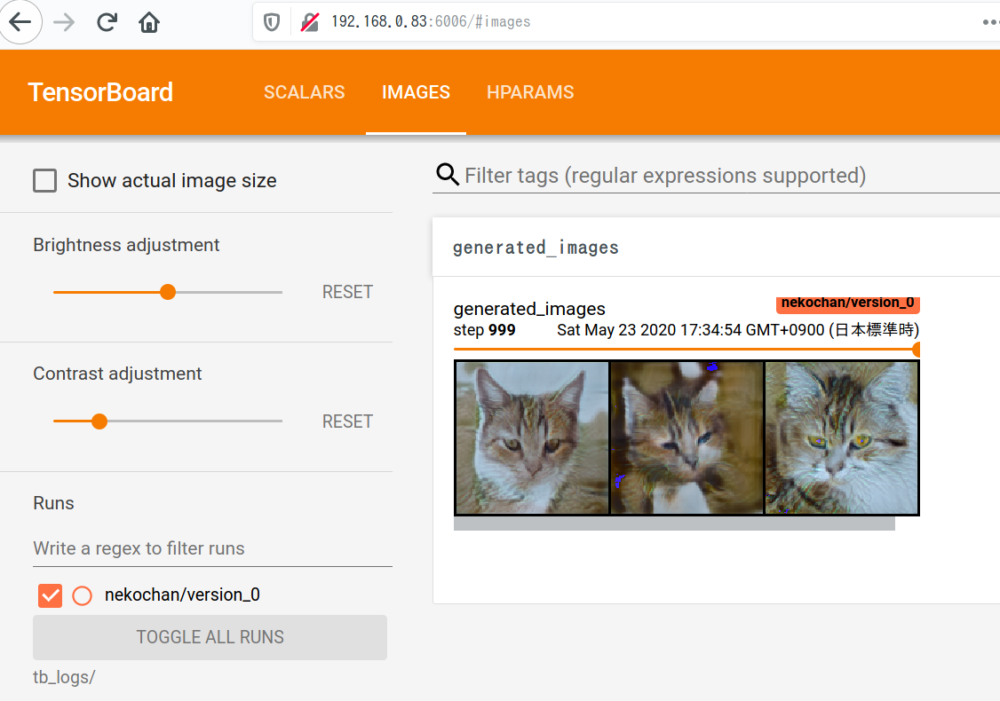

# 今週やったこと

## 2020.05.23 モチ会 19 回

### tackman

---

# 今週やったこと

## StyleGAN2を学習回せる状態にした

- 細かい部分全部詰めたら関連論文5本くらい精読することになった・・・
- ソフトウェア工学面
- TensorBoard
- AFHQという手頃なデータセットが提供された

今週のTipsで解説します

---

# 今週やったこと(misc)

- 読書
  - 力学系入門 11章まで
    - カオス以外の非線形系の内容
  - 実践GAN
    - 基本的に知ってることの本だったので流し読み
    - これからGANを実装する人にはおすすめの一冊
- キャラデ作業
  - TwitterでフォロワアがLive2D受肉してたので
  - 自分の性癖と向き合えました（こなみ）

---

# 今週の GAN Tips

---

# PyTorch Lightning利用での構成

- 模式的には networks.py / trainer.py / main.py / dataset.py
  - 図を作った方が分かりやすいけど時間がなかった、すまない

今どきのGANはネットワーク構造以外は似たようなアルゴリズムを利用しているので、
trainerはそのままでnetworksだけ差し替えなども割とできる

何やるにしても基本はこのパターンに乗せれば大丈夫そうという手応えをつかめた

---

---

# TensorBoard

- だいたいスクショの通りのツール
- 名前の通りTensorFlow派生ツールだけど、今どきの深層学習ライブラリはだいたいTB出力対応してる
  - PyTorch LightningだとプリセットのTB loggerを設定するだけでOK
- 特にGANだと出力画像を見て定性評価をしたいところ、サンプル画像ログ機能があり別端末からブラウザで確認できるのが神

---

# AFHQ Dataset

- 動物顔画像の高解像度データセット
- 人間の顔でCelebA-HQという有名データセットがあるけれど、個人的に人間の顔はGANの実証実装に向かないと思ってる
  - 人間は人間の顔に関してかなり特化した認知能力を持っている
- 一方でベッドなど無機物だとトポロジカルな複雑性が少なかったり、雑な生成結果でも人間が気にしなかったりする
- ので動物の顔というのはバランスが取れている、と思う
- ねこかわいい

---

# 参考文献

- StarGAN v2 https://github.com/clovaai/stargan-v2
  - AFHQの作成元
- TensorBoard https://www.tensorflow.org/tensorboard
- 「力学系入門」 https://www.kyoritsu-pub.co.jp/bookdetail/9784320111363
- 「実践GAN」 https://book.mynavi.jp/ec/products/detail/id=113324