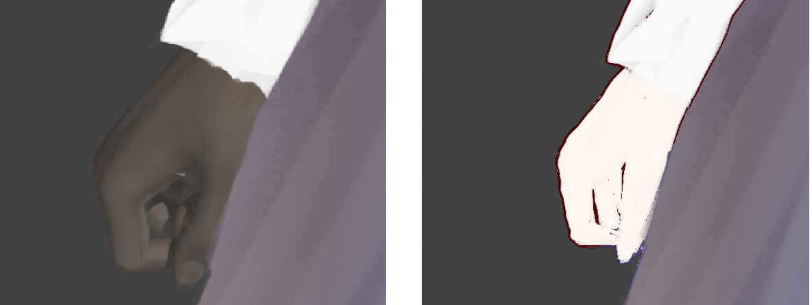
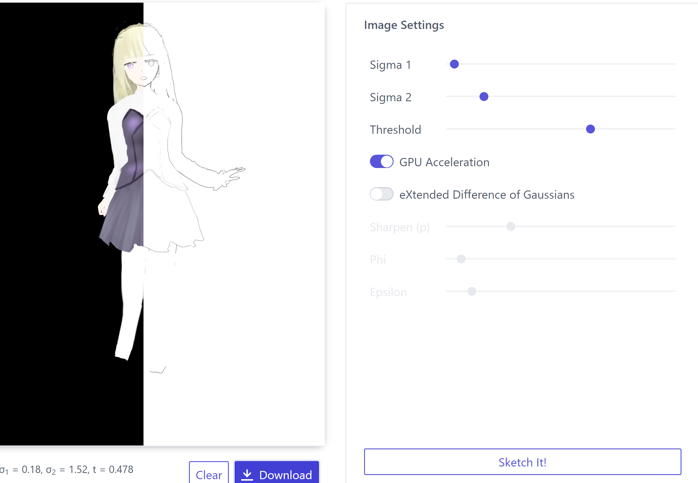
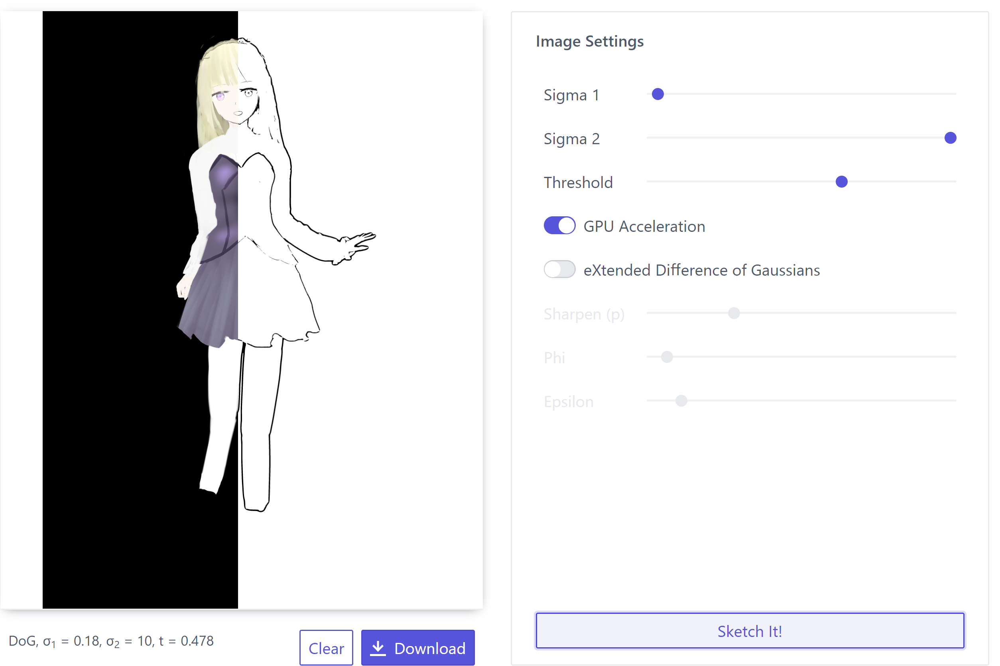

# 進捗報告＆調査中事項

## 2020.06.27 モチ会 24 回

### tackman

---

# 今週やった

- キャラクターイラストの作成手法いろいろ
  - ドール写真のトレスしたりとか
  - Handyで手を作ってトレスしたり
  - XDoGで線画作れないか試したり
- 売上管理機能をつけた choubo.js v2 リリース
  - 確定申告作業時に手元作業用に使ってたやつ
  - v1から費用入力機能なども移植の上でReactで再実装した

---

# ドールのトレス

### ここが良い

- プロポーションが崩れにくい
- 構図の最終形が分かりやすい
- よくあるイラスト用3D人形よりポーズなどを取りやすい

### ここが足りない

- 顔まわりはフルスクラッチで描き直す必要性が高い
- 手の形のバリエーションがどうやっても足りない
  - これはHandyで克服できた（後述）

昔に比べて3Dモデルが手に入りやすい時代になっているので、
ポージングのハードルを埋めるといいのでは・・・？

---

# Handy (スマホアプリ)

- 手のポージングをするシンプルなアプリ
- 操作性はひどくはないが良くもない
- モーションキャプチャーツールと連動できると嬉しそう

---

---

# トレス例

---

# XDoG Sketch

- 古典的画像処理による輪郭抽出アルゴリズム
- XDoGという手法があるらしい→いい感じのWebツール既にあるやんけ
  - https://xdog.alexpeattie.com/
- 線画作成の工程が自動化に使えないか試してみてる

----

---

---

# 参考文献

- Handy http://handyarttool.com/
- XDoG  An eXtended difference-of-Gaussians compendium including advanced image stylization
  - https://www.sciencedirect.com/science/article/abs/pii/S009784931200043X
- XDoG Sketch https://xdog.alexpeattie.com/