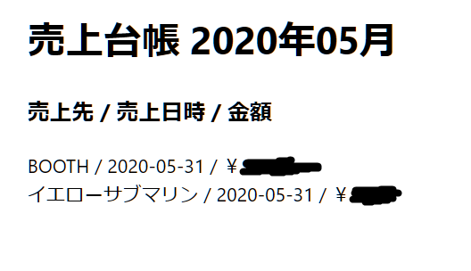

# 持続化給付金申請Tips（＆進捗報告）

## 2020.07.04 モチ会 25 回

### tackman

---

# やった

- CVPR2020全チェック
  - コンピュータビジョンのトップカンファ
  - 注力分野で使えそうな論文あさり
  - タイトルとアブスト見て使えそうなやつを探す
  - 今数えたら1000件以上あるっぽい…？
- 持続化給付金申請
  - 申請不備を指摘されて再提出済み(昨日)
  - これで通るのかは不明

---

# 持続化給付金の申請

- 前年度の確定申告は前提
  - 確定申告した時の書類は出した状態で作業するといいです
- Web上からの申請で完結する！
  - そこそこモダンなデザイン
  - 電子申告にカードリーダーが～～等は不要
  - アカウントも今どきのWebサービス同様に作れる
  - とりあえずフォーム入力する→必要書類が足りなくなった時点で集めるでいける
- 受給額の計算などは自動でやってくれる！

色々ある事業ですが、申請フォームまわりはそこそこ頑張って作ってると思います

---

# 意外と必要なもの

- 売上半減月の売上帳簿
- 私の場合DB(Firestore)に突っ込んでるだけなので、その場で表示機能作ってスクショを提出
  - これでええんか？と思ったけどここは特に突っ込まれなかった

---

# 申請でよく分からなかったところ

- 「前年度収入」の定義
  - 確定申告と用語が違う…
  - 事業収益かな？と思って記入して出したところ、確定申告と一致しない不備扱い
  - いかがですか記事だと売上をそのまま記入でいいらしい。ほんまか？
    - とりあえず再提出は売上を記入して出してみた
- 確定申告がお役所の受付された証明が必要っぽい雰囲気だったけど、なくてもスルーされた
  - 郵送をした関係で受付印をもらってない
  - 税務署からの受領ハガキ等は添付しなかったけど、特にお咎めなし

---

# やろう！持続化給付金

- お役所申請系の中ではかなり難易度が低いと思います
- 不備があってもちゃんとメールで通知してくれます

---

# 参考文献

- CVPR2020 https://openaccess.thecvf.com/CVPR2020
- 持続化給付金ポータル https://www.jizokuka-kyufu.jp/
