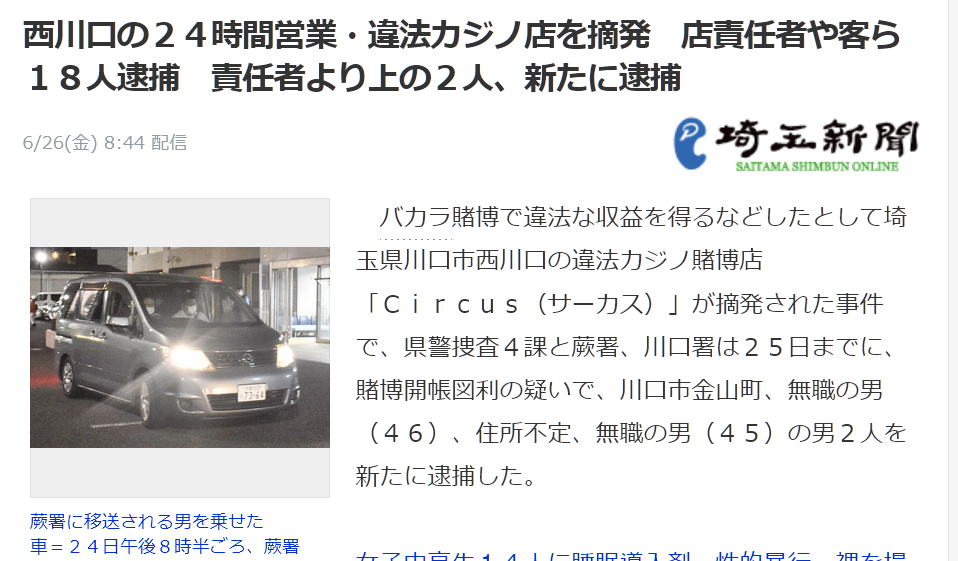

# 西川口チャイナタウン報告

## 2020.07.11 モチ会 26 回

### tackman

---

# 今週の進捗

- 手を動かした量は無
  - 労働が若干闇ったり
  - ↑から気づいたらラノベ10冊以上読んでた、そりゃ時間がなくなる
- 一応今年上半期が終わったので、課題整理的なことはした
  - ただ3ヶ月や半年かけてこれやるぞ！となるものが出なかった
    - 進捗が無になった理由の一部

というわけで今回は西川口チャイナタウン紹介をします

---

# 西川口チャイナタウンとは

- 西川口駅を降りて西側に広がる「本物の」チャイナタウン
- そんなに大きくないし、観光地でもない
  - なので横浜中華街のような観光要素を期待して行くとガッカリするかも
- 街並みはフツーの駅まわり繁華街という感じ、ただし異様に中華料理屋が多い

---

# たまたま訪問した前日にガサ入れがあったらしい

---

# 盛興順鉄鍋炖 上野店

- 上野店を名乗ってますが西川口にあります
  - 看板もばっちり上野店
- 日本語メニューが実質ない、中国語漢字のみ
  - ピンインもついてない
- 店内の張り紙も日本語がない
- おばちゃんに漢字を音読みしても通じない
  - まともに中国語発音できる人がいなかったので、指差し注文
- 山崎ボトルキープが10本以上見えた
  - 「この辺シメてる連中の溜まり場なのでは？」(by 元パチプロ・雀荘店員)

---

# 謎の輸入雑貨屋さん

- 中国直輸入品がいっぱいある
- 安い、実際お得
- クミンとか安かった
  - インドカレー用に使うので助かる
- 店員の接客やる気が一昔前のチャイナクオリティ、あるいは昭和日本並
  - こちらも変な気を使わなくて楽でいい

---

# まとめ

## 手軽に行ける海外体験

- そして中華なので飯は美味い！
- 人は選ぶと思います

### 行こう、西川口チャイナタウン！
