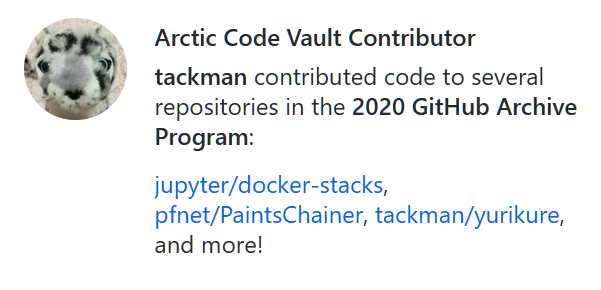
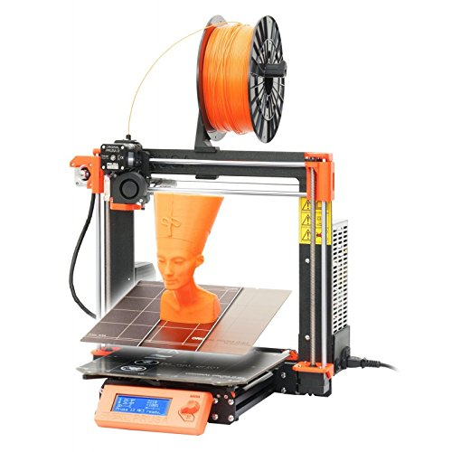
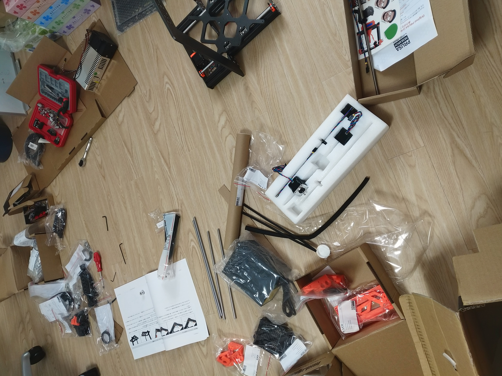
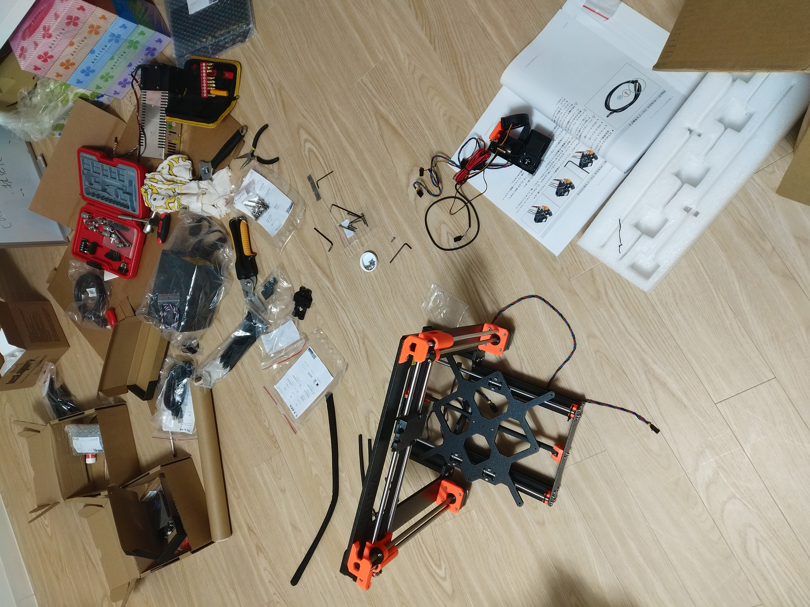

# 今週の進捗

## 2020.07.18 モチ会 27 回

### tackman

---

# 近況報告

## 北極圏に百合紅のデータが永久保存されました

https://archiveprogram.github.com/

---

# 3Dプリンタ組み立ててた

- 去年節税兼ねて買ったけど積んでたやつがある
- ドール向け小物3Dプリンタ用データが販売してたので、この機会に着手
- 月曜に着手して終わってないんだが？？？

---

# 製品について

## Original Prusa i3 MK3S 組み立てキット 日本正規版

 

---

# 製品の詳細

- オープンハードウェアの類
- パーツの樹脂的な部分は3Dプリンタで自己複製できる
- Prusaは老舗高品質で安牌の選択肢、らしい
- 組み立てキットは3Dプリンタが部品の状態で届くので、自分で組む
  - 完成品がそのまま届くやつもあります

---

# 組み立てについて

## 現況（月曜と土曜の比較）

---

---

---

# もぅﾏﾁﾞ無理。アニメ見ょ

- 組み立てマニュアルが四捨五入して200ページある時点で察し
  - 日本語正規版なので日本語化されているけど、原文だったら…
- ガバい取り付けすると精度に影響出るはずなので神経を使う
  - 動けば品質に影響のない自作PCに比べてキツい
- 3Dプリンタ出力された部品がギチギチで、パーツのはめ込みが大変
  - 一部パーツはハメたら破壊以外に取り出し困難なものがある
  - とにかく時間をかけてパーツの穴を慣らすのを迫られたりした
    - 手は動かすけど目と脳がヒマなのでアニメ視聴が進んだ
      - かぐや様は告らせたいが良かったです

---

## 良いところもあるよ！

- はんだ付けは求められない
  - 最近流行りの自作キーボードよりはハードル低め、な気がする
- 必要な工具は全部セットで送ってくれる
  - ペンチや六角レンチなど
  - あとグミ

---

# 全体として

- 組み立ては時間をかけてじっくり作る「趣味的」にやる人向けという印象
  - 不慣れかつダラダラやったのを差し引いても、相当な時間の覚悟が必要
  - 自作の模型やドールと同様に愛着は湧くと思う
- 3Dプリンタを試したい・使う必要がある人は、最初は完成品を買う方がよさそう
- 教育効果は間違いなく高いとは思います
  - イニシャルの教育コストを払えるならですが・・・

今日組み上げた報告をするつもりだったけど、全然完成しなかった💢
来週にたぶん続く

---

# 参考文献

- Prusa Research https://www.prusa3d.com/
- Original Prusa i3 MK3S 日本正規版組み立てキット
  - https://www.amazon.co.jp/dp/B07FTHMPSQ/
