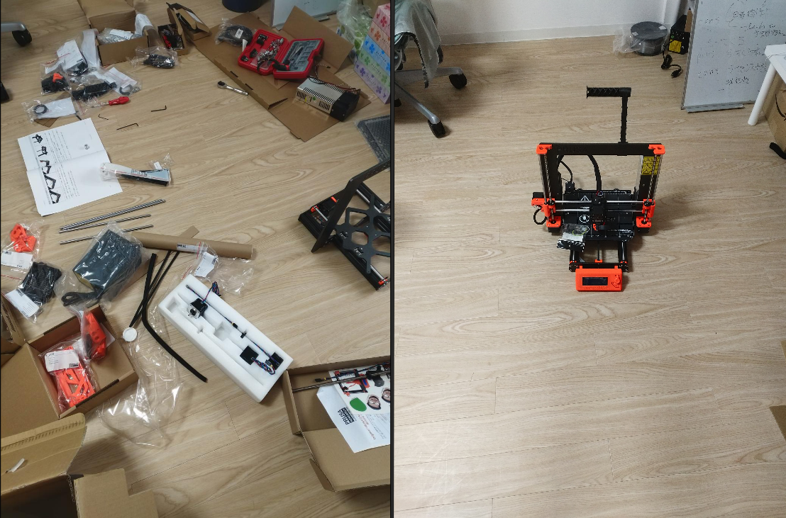

# 書籍制作の紹介

## 2020.08.08 モチ会 30 回

### tackman

---

# やったこと

- ウィングスパン攻略本制作
  - 電子版が発行されました！
    - https://bgb.booth.pm/items/2265217
  - 原稿執筆とかITインフラの面倒見たりとか
  - 物理本は発行検討段階
- 3Dプリンタ組み立て完了！
  - 部屋が本来の広さを取り戻した
  - 200p分の組立作業をやりきったぞ！
  - そして次に70pの印刷マニュアルが・・・

---

---

# Re:Viewでの執筆環境

---

# ボドゲ攻略本での制作実績

- いずれもRe:Viewで組版
  - 「テラフォーミングマーズ徹底解析」
  - 「ウィングスパン徹底解析」
- ボドゲ攻略会「ボードゲームブレイカーズ」より発行

火星本も鳥本もほぼ同様の方法でやったので、以下区別せず解説

---

# Re:View とは

- マークアップで書籍を作れるツール
- 日本語圏だと一番メジャーなんじゃないかな
- そこそこ歴史があり、商業書籍の執筆実績も多数

超メジャーなのでみんな自分で見て(雑) https://github.com/kmuto/review

---

# ボードゲームブレイカーズについて

- ゲーマーズゲーム大好きボドゲプレイヤー集団
- 一つのゲームを突き詰めてプレイしがち
  - 広く浅くはやらないので、プレイタイトル数は少なめ
  - 「趣味ボドゲじゃなくて趣味テラフォ」
  - 半分くらいはCivBG本作ってた頃から一緒
- メンバーの文章作成能力とITスキルはかなりまちまち
  - 流石にパソコン使えません＞＜という人はいない
  - gitだのマークアップだのエンジニアがよく使うツールは基本知らない
  - 一人で文章を仕上げまでできない人が多数派
    - 文章とITインフラで1～2名ずつ基幹技術持ちがいる感じ
- ボドゲのプレイスキルは高めで揃っている

こういう感じのメンバーが5人～10人くらい集まって原稿執筆をしている

---

# 大雑把なワークフロー

1. 草稿をプレーンテキストで集める
2. Re:Viewファイルにまとめる
3. 文章や章立てなど校閲作業をする
4. PDF生成はGitLab CIが勝手にやってくれるぞ
5. 表紙などを整えて完成！

---

# 原稿の執筆に関して

- 大半のメンバーはマークアップ言語での記述ができない＝Re:View記法は使えない
- プレーンテキストで書いてもらい、マークアップできる人がRe:View記法へ

---

# 原稿の管理

- git / GitLab で管理
- メンバーの大半は git を触れないので、git commitはgitのできるメンバーがやる
  - gitできなくても、GitLabのWebからファイル操作をすることはある
  - Re:Viewビルド対象へのディレクトリ下は約束で操作禁止

---

# PDFのビルド

- git push されると GitLab CI で自動的にビルドが走るシステムになってる
- Re:View公式がDcokerイメージを用意済みなので、比較的簡単に構築可能
  - review-pdfmaker でPDFが直接生成できる
- 10行程度の設定ファイルで完結する

CIビルドはやらない理由がないレベルで楽です

---

# 他の攻略本制作体制との比較

- インデザ手作業系
  - CivBG本、カタンサバイバルタクティクス
- インデザスクリプト活用系
  - 伊川清三さんのところ（推定）
- Photoshopで全ページ手動割付（！？）
  - ドミニオンマニアックス（初代）

---

# Re:Viewのいいところ悪いところ

## いいところ

- 組版に頭と手間を使わずに済む
- CI化していれば最新版PDFが随時ダウンロード可能（文明！）
- 無料（Adobe税不要！）

## 悪いところ

- 凝ったレイアウトは苦手
  - やってやれなくはないけど、LaTeX黒魔術に手を出す羽目になる
  - そもそもPDFMakerがLaTeX黒魔術に依拠してる、絶対触りたくない
    - 気になる人はコード見るといいと思います
- 技術書・評論本以外を作るのはあまりサポートされていない

---

# 使おう、Re:Viewで執筆

テキストメインの本では試す価値があります

---

# 参考文献

- GitLab CI https://docs.gitlab.com/ee/ci/
- Re:View image for Docker https://github.com/vvakame/docker-review
- ボードゲームブレイカーズ
  - テラフォーミングマーズ攻略本 https://w.atwiki.jp/bga9997/pages/142.html
  - ウィングスパン攻略本 https://birds.bgb.cards/
- 伊川清三さん @s_igawa https://twitter.com/s_igawa
- カタンフリークス https://www.catanfreaks.com/
- CivBGeeks https://civbgeeks.net/

間に合わなかったから後で追記します