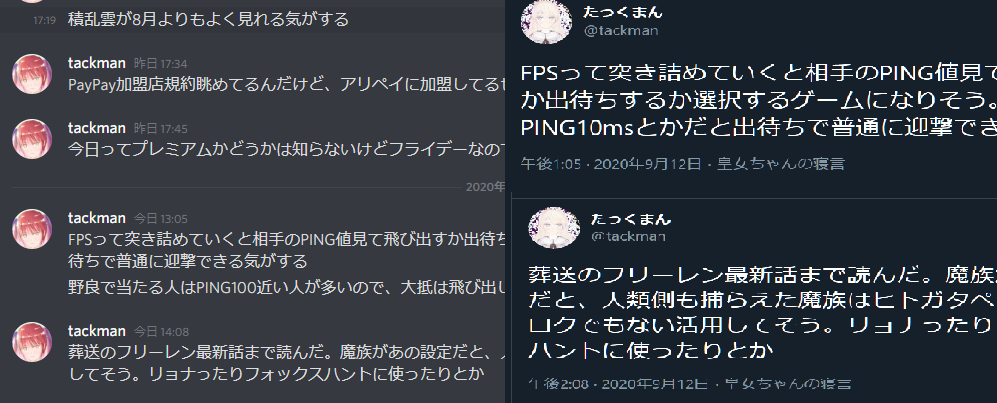

# 今週の進捗

## 2020.09.012 モチ会 35 回

### tackman

---

# 今週の進捗

- ま、まともな進捗が…
- Twitter投稿botは作った

---

# Discord経由Twitter投稿bot

- Discord経由でTwitterに投稿するbot作った

---

# なぜこんなものを…

- 独り言をツイートしたくなる時がある
- ターミナル経由からツイートする手段は既に使っていたが、Windowsからはこれという手段がなかった
- ツイートするたびにTwitter.comやtweetdeckを開かずに済むようにした

---

# 仕組み

1. ツイート専用チャンネルを監視するDiscord botを用意
2. Discord上での発現をトリガーにTwitterへ投稿

---

# Discord botについて

- DiscordにはWebhook機能があるが、メッセージのリアルタイム取得には使えない
- Discord Appのbotとして作成することで、WebSocket経由の接続ができる
  - リアルタイムにDiscord上の特定部屋内のメッセージを取得可能

---

# バックエンド

## Discord.js を利用

- TypeScriptで作成
  - 型定義ファイルも用意されている
- 認証まわりやREST呼び出しなど面倒なことをする必要がない
- WebSocketで常時接続する都合上、さしあたり自宅サーバ上で動かしている