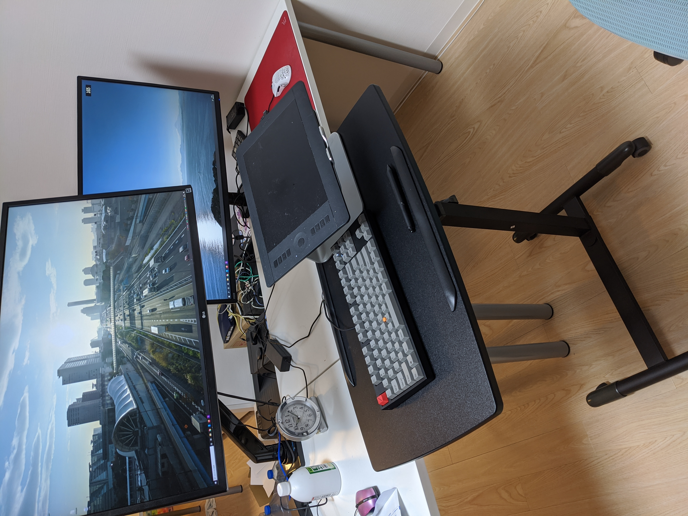

# 今週の進捗

## 2020.09.26 モチ会 37 回

### tackman

---

# 進捗報告

## imagetok

- ネット画像閲覧専用アプリの紙プロトやった
- create-react-appしたのであとは手を動かす

## ofuton

- 新作ボードゲーム
- ハンドアウトが書ける程度にゲームシステムまとめた

## その他

- mastodonの自鯖復旧させた
  - 障害レポート http://tech.tackman.info/2020/09/22/mastodon-fault-report

---

# ペーパープロトタイピングの風景

---

# 立ち作業スペースを作った話

---

# 立ち作業風景

---

# グッズ一覧

## 新規購入

- モニターアーム
- スタンディングデスク
  - サンワサプライ、高さ調整機能つき
  - 最初に買った中国製はチャイナクオリティで返品した…

## 既存品流用

- 板タブ（Intuos 5）
- PC用スタンド
  - 元々はノートPCを乗せる台だったものを板タブ乗せに流用
- 赤ポチつきキーボード

---

# 作業スタイル

- 板タブがメインのポインティングデバイス
  - ペン入力とタッチモードを併用
  - ホイール入力もできるので意外とマウスなしでも回る
- 画面を2～3分割して、正面位置は人間が動いて調整
- （右側のサブディスプレイはほぼゲーム/動画閲覧専用）

---

# 狙いと考察

- 慢性肩こりがひどく、それの改善したかった
- 体幹強化
- 集中力維持

## 課題になりそうな点

- 体重の重い人だと膝の負担がキツいかも