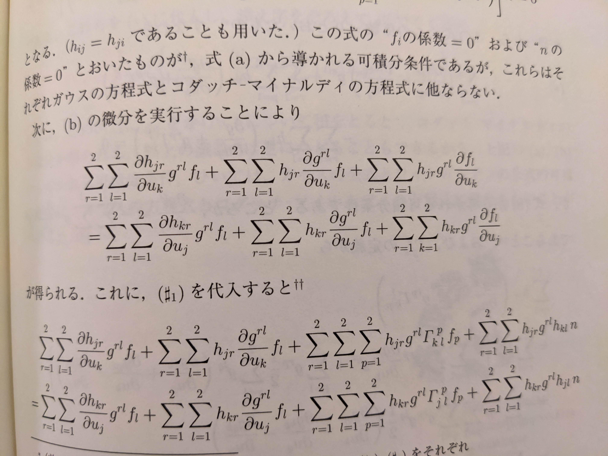
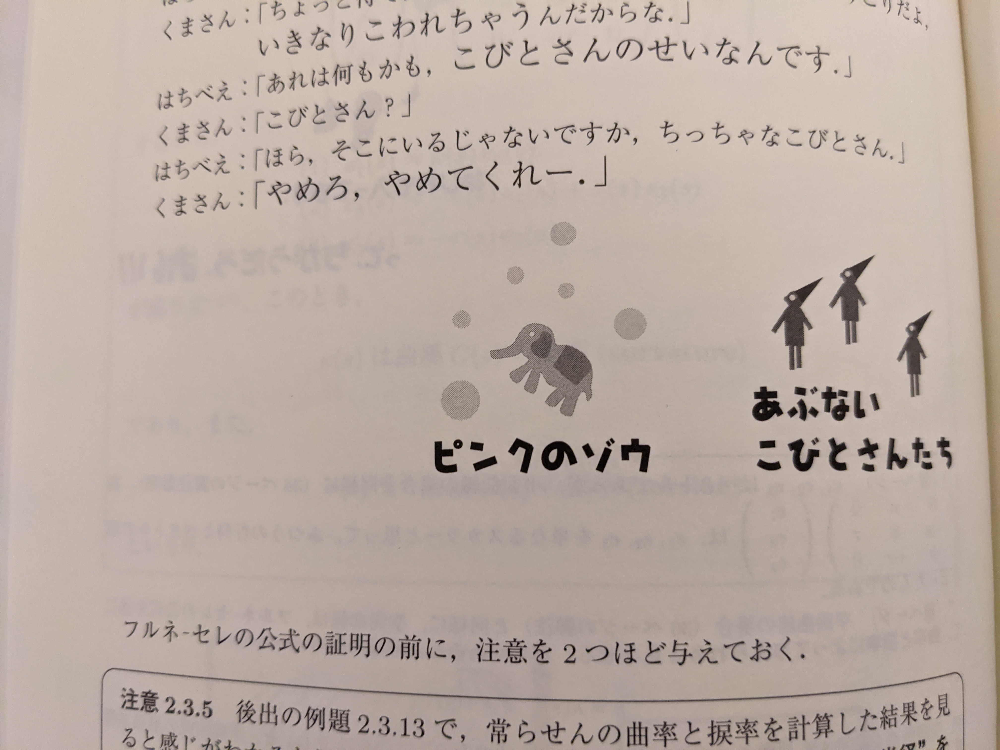

# 今週の進捗

## 2020.10.03 モチ会 38 回

### tackman

---

# 今週の進捗

## imagetok 画像鑑賞収集アプリ

- プロトタイピングやった
- CSSアニメーションをやる必要があり調査した
  - CSSアニメーションは成書が全然なくてびっくりした
    - CSSの本で探すとデザイナ向けのものばかりで、テクニカルアーティスト向けは皆無でびっくり
- React/CSSアニメーション向けフレームワークで、framer-motionを選択
  - React motionというライブラリがあるが別物
  - このあたりの詳細は来週あたりにしたい

## 微分幾何学の入門書読んだ

初心者にやさしい本で一気に読んでしまった(このあと紹介します)

---

# 「じっくり学ぶ曲線と曲面」

- 独修者にやさしい「内容が薄くて厚い本」
- 謎のオヤジギャグとIllustratorで描いたことを強調する謎イラスト
- 定理の主張に関して、そのココロや何がすごいのかを丁寧に解説

## 内容と難易度

- 学部3〜4年向けという感じ
- 多様体とリーマン幾何学に一切触れない
- 初等的な曲線の話から曲面の第一/第二基本量、ガウス驚異の定理やガウス・ボネの定理まで
  - 曲面に関して一通りの内容になってる

---

# 雰囲気を見るための抜粋

---

---

# 微分幾何ってそもそも何よ

- 幾何に対して解析的な道具を導入したもの
- 微分可能な線や曲面を扱うので「微分幾何」

## 使い道あるの？

- 個人的動機：VRでのレンダリングで解こうとした問題があった
  - 厳密解は存在しないという方向で解決されました
- CG方面では潜在的に利用できそうな気がする、知らんけど
---

# 参考文献

- Framer Motion https://www.framer.com/motion/
- じっくり学ぶ曲線と曲面 -微分幾何初歩- 中内伸光
  - https://www.kyoritsu-pub.co.jp/kenpon/bookDetail/9784320017887