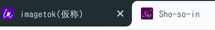

# 今週の進捗 / Framer Motion紹介

## 2020.10.10 モチ会 39 回

### tackman

---

# 今週（まで）の進捗

- imagetok(画像閲覧アプリ)
  - プロトタイピングdone
  - 次：サービス設計
    - バックエンド設計とか具体的にどの画像を取得するかとか
- 会社法の勉強 2/3 くらい
- ofuton(新作ボドゲ)
  - 経済メカニクスの設計具体化した、はず
- zennに記事投稿してみた
  - https://zenn.dev/tkmn/articles/e0d75cab7f942c7cd819

---

# 今週のTips

---

# Framer Motion

https://www.framer.com/motion/

## CSSアニメーションライブラリ

すごく雑な利用例

https://youtu.be/_xHLBD6txyU

---

# Framer Motionの簡単紹介

- React向けCSSアニメーションライブラリ
  - これとは別にReact Motionというライブラリもあるが別物
- Hooks利用スタイル
- アニメーションを宣言的に記述

次ページでサンプルコード

---

```typescript
import { motion, useMotionValue } from "framer-motion"

export function MyComponent() {
  const x = useMotionValue(0)
  return <motion.div style={{ x }} />
}

const x = useMotionValue(0)
const input = [-200, 0, 200]
const output = [0, 1, 0]
const opacity = useTransform(x, input, output)

return <motion.div drag="x" style={{ x, opacity }} />
```

- Hooks利用でアニメーション状態変数を管理可能
- JSX内にアニメーションの宣言的記述

---

# Favicon Generator

https://favicon.io/favicon-generator/

- 2秒でfavicon作れる
- 日本語フォントがないのはご愛嬌



劇的に改善したタブのアイコンの図
