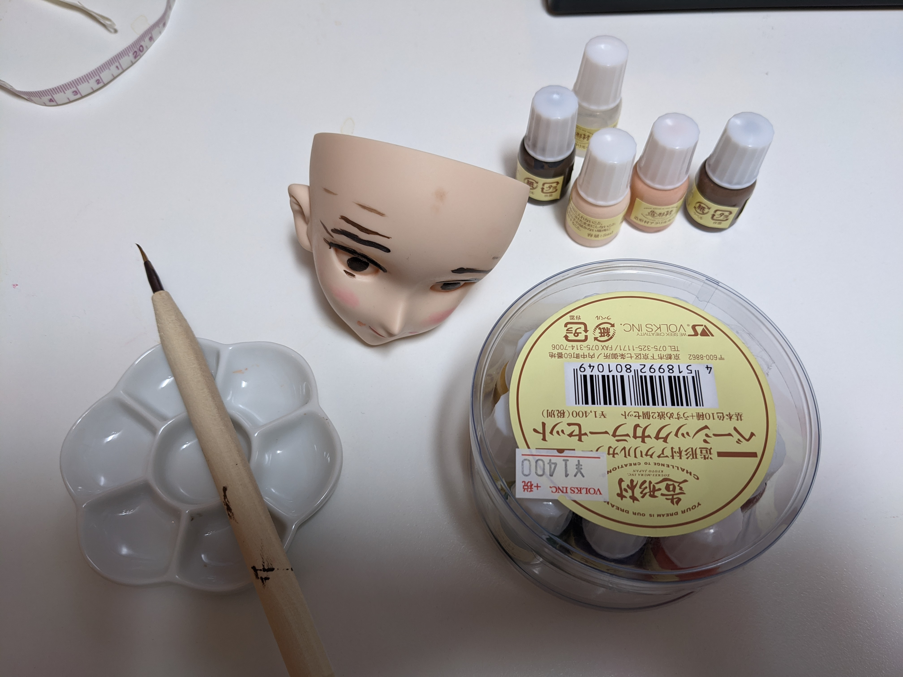
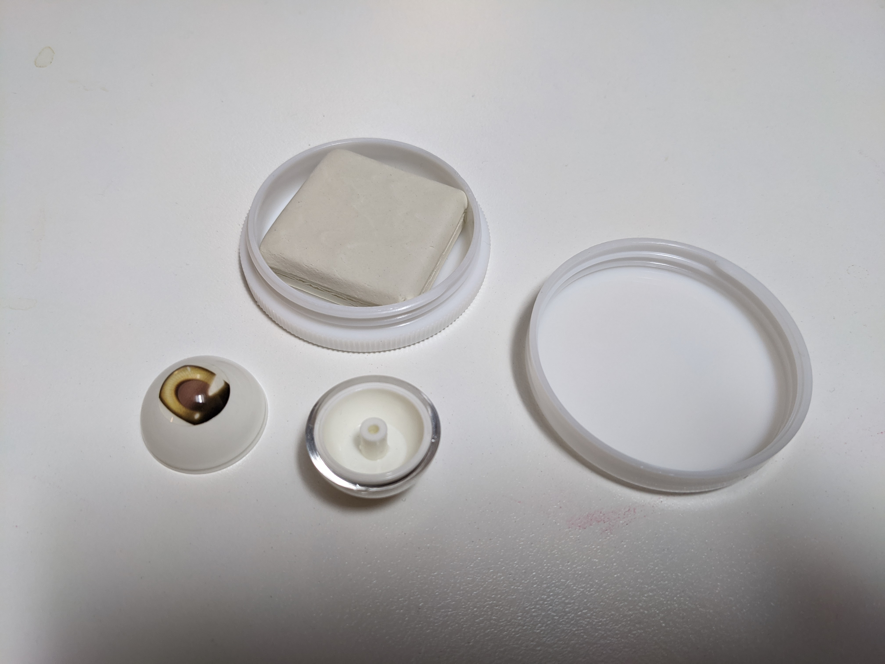
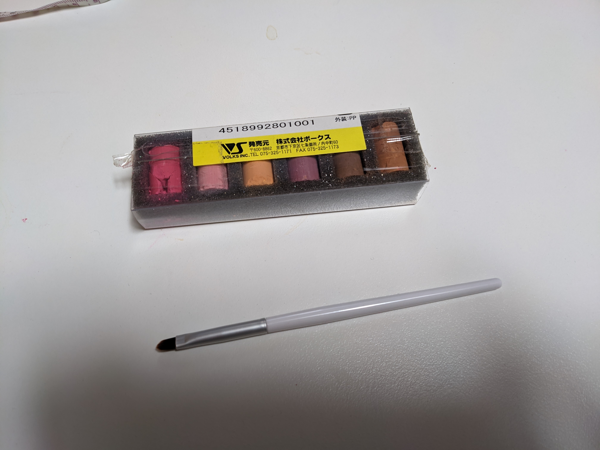

# 今週の進捗

## 2020.10.17 モチ会 39 回

### tackman

---

# 進捗報告1

## ofuton(新作ボドゲ)

- ルールテキスト書くところまで基本システム具体化した
- テストプレイに向けて、必要最低限のカードテキスト書いてる

スプシ→テスト用カード画像生成を自動化しないとつらそうなので、
今度さくっと作る予定

※お仕事再開したり尾てい骨挫傷したりしてアウトプットﾁｮｯﾄ足りてない

---

# カードデータ作成中…

---

# ofuton テストプレイまでの残タスク

1. カードデータを埋める
2. 一人回し
3. このゲームを作ったのは誰だあ！→1に戻る

---

# 進捗報告2?

## ドールヘッドのメイク

疲れからかドールヘッドのメイクに手を出してしまう
（限られた季節にしかできないので敢えてやった面もある）

1. 塗料でアイライン・口をつくる
2. つけまつげをつける ← ここまでやった
3. 瞳を装着
4. パステルチョークで赤みをつける

3,4 は工程として軽いので8割できたと言っていい

---

# Tips: ドールヘッドのメイク

---

# 生まれた時のドールヘッド

ボークス公式より引用 https://dollfie.ec.volks.co.jp/item/4518992428710.html

---

# 塗料とつけまつげまでやったところ

---

# 塗料まわり

---

# つけまつげ

---

# アイ

---

# パステルメイク

