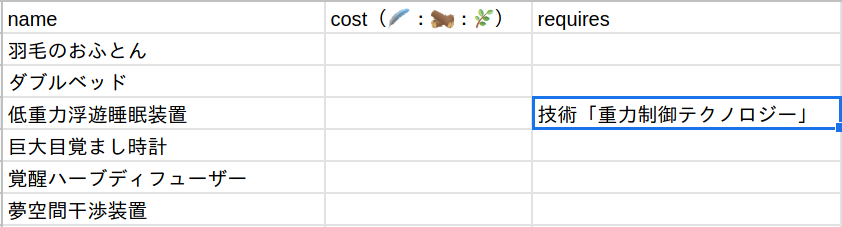
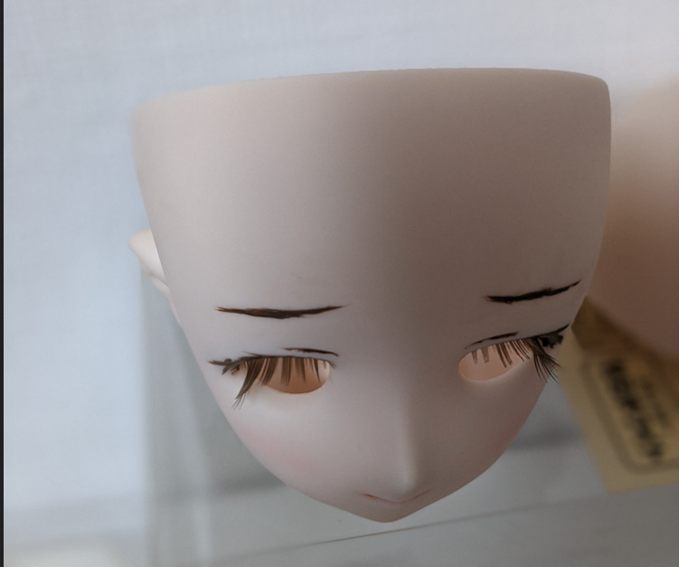
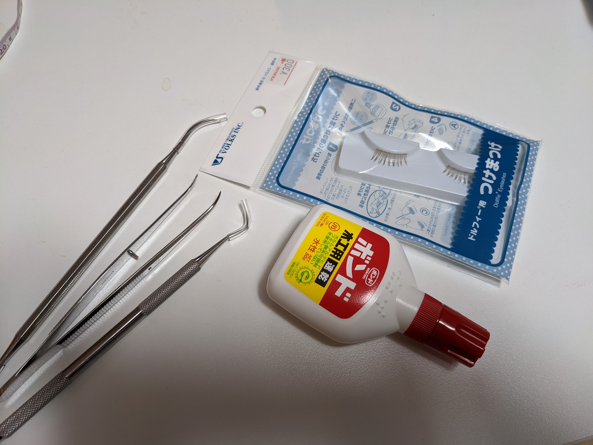
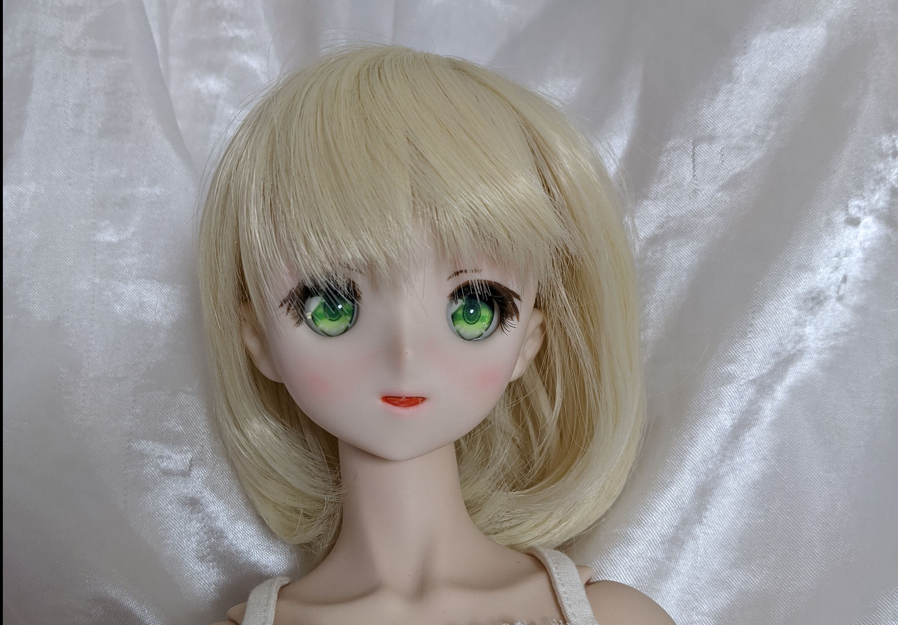

# 今週の進捗

## 2020.10.24 モチ会 41 回

### tackman

---

# 進捗報告1

## ofuton(新作ボドゲ)

- ルールテキスト書くところまで基本システム具体化した
- カードテキストなどのデータも一通り作ってみた

一旦ゲームのルールは作ったので一人回ししてみた

→ いろいろ課題が見えたので他人を交えたテストプレイは一旦おあずけ
　もう一週間一人回しでシステム改善

---

# 画像は開発中のもの（先週時点）

---

# 進捗2というか取り戻す報告

## メインのArch Linux開発機が逝ったので再構築

- AntergosというArch派生ディストロを入れていたけど、プロジェクトが死亡
- Archなので一応使えていたけど、パッケージ依存関係でついにトラブル発生
  - デスクトップログイン不能に
    - なんとかしようと弄ってたらGRUB飛ばして起動不能に(・ω<) てへぺろ

## 素のArchを入れ直し

- いろいろスッキリした
- 気分でデスクトップ環境を Cinnamon → KDE Plasmaに乗り換え

---

# 進捗報告3?

## ドールヘッドのメイク

疲れからかドールヘッドのメイクに手を出してしまう
（限られた季節にしかできないので敢えてやった面もある）

1. 塗料でアイライン・口をつくる
2. つけまつげをつける
3. 瞳を装着
4. パステルチョークで赤みをつける

---

# Tips: ドールヘッドのメイク

---

# 生まれた時のドールヘッド

ボークス公式より引用 https://dollfie.ec.volks.co.jp/item/4518992428710.html

---

# 塗料とつけまつげまでやったところ

---

# 塗料まわり

---

# つけまつげ

---

# アイ

---

# パステルメイク

---

# ドールヘッド現状

---

# もうちょっと手を入れたい

- 眉と口内まわりを描きなおしたい
- パステルメイクもうちょっときれいにしてあげたい

---

# 参考文献

- Arch Linux インストール俺々式完全版
  - https://qiita.com/TsutomuNakamura/items/b60518f8788e5e998744
  - Arch wiki以外で今回参照したページ
