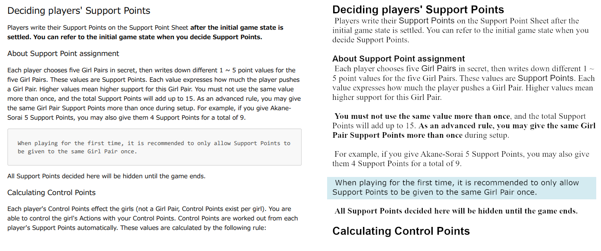

# 今週の進捗

## 2020.11.08 モチ会 42 回

### tackman

---

# 今週の進捗目次

- ofuton(新作ボードゲーム)
- 百合紅 英語版ルールブック（印刷向け作業）
- イラスト制作手法
- fanbox準備

---

# ①ofuton(新作ボードゲーム)

- 進捗無
- 毎日30分から1時間程度は考えてはいる
- メカニクスの再構成で行き詰まりを感じている

コンセプトレベルではいける手応えがあるので、引き続きがんばる

---

# ②百合紅の英語版ルールブック

- ちゃんと印刷用のレイアウト作業したら結構大変だった
- 結構差がつくので真面目に作業せざるを得なかった

---

# ルールブックのレイアウトツール

### Photoshop2021

- 当初これでやるつもりだったが *終わってるレベルで使いづらい*
- カーソルやテキスト選択範囲表示など、本当に基本的なことが出来ない

### Clip Studio

- PSと違ってちゃんと操作はできる（これだけでも偉い）
- ただテキスト割付用途には向いていない
  - 漫画・イラストの効果テキスト向けな感じ（妥当）

### GIMP

- まさかの救いの神だった
- 「手動で文字の割付作業をしたい」という需要にマッチ

---

# ③イラスト制作手法

- 前回のやつから権利上問題のない画像利用に差し替え
- ついでにライティング変えたらそれっぽくなった

---

# ④fanbox準備

創作関連テキスト置き場＆本にならない分量のコンテンツ置き場として運用予定

## 直近で投稿予定のコンテンツ

- 百合紅の世界設定メモ
  - 舞台が22世紀末で、一応背景は考えてるので忘れないうちに
- ノンイラストレーターズイラストレーション記事
  - とりあえず今週作ったイラストの制作手法
