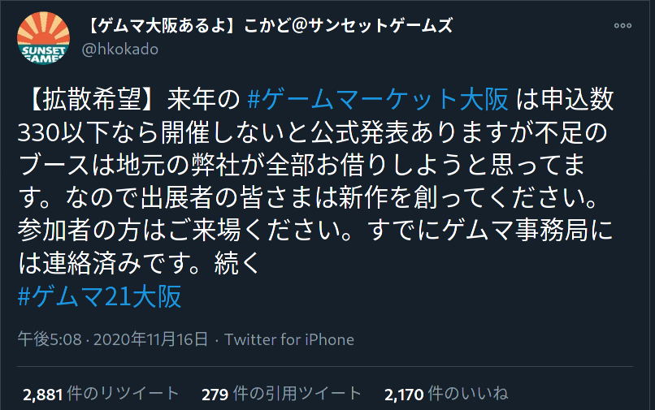
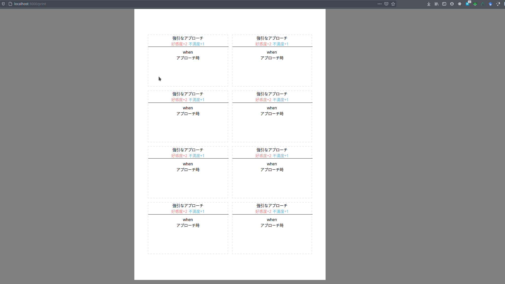

# ゲムマ報告回 / 今週の進捗

## 2020.11.22 モチ会 43 回

### tackman

---

# 進捗①fanboxに初投稿した

https://tackman.fanbox.cc/posts/1536124

- とりあえず100円プランの記事一本
- 近日中に500円プランの記事も投稿予定
  - というか書きかけのものがある

---

# 進捗②百合紅 新作拡張

- ゲムマ大阪合わせで新作を出したくなったので、産めそうな百合紅拡張で

- ☑ゲームシステム
- ☐カードリスト

---

# カードプリンター

- 百合紅拡張でカードを扱う予定があるので、割付を楽にするため着手した
- Nuxt+tailwind
  - tailwindは @ymkt さんが前に紹介していたやつ

---

# ゲームマーケット2020秋の感想

---

# ゲムマ秋の基本情報

## 一般入場のシステム

- 電子チケットで午前の部/午後の部それぞれのチケット販売
- 3時間ごと、途中休憩を挟んだ完全入れ替え制
- 各部それぞれ「開幕から入場」「開場1時間後から入場」「開場1.5時間後から入場」「開場2時間後から入場」のチケットが販売
- 早期入場は販売数制限あり（300枚ずつ）
  - 去年までは1日1.5万人が入場したりしたので、チケット数はかなり少ない
- 最終的な来場者数は、前回の半分程度になった模様

私の参加状況：1日目はボドゲのサークル、2日目は本を出すサークルで両日参加

---

# ゲムマ秋の雰囲気

## 一般参加者の雰囲気

- 来場者数はやはり少ない
- 去年までは年々増加していた家族連れがほぼ絶滅
- 売れ行きは来場者数とほぼ比例している感じ
  - 購買意欲自体は今のところ衰えてなさそう

## 出展側の雰囲気

- この情勢でイベントに来る覚悟完了勢が多い
  - 数が減った分、気合の入ったサークル以外が淘汰された感
- 出展数が減り、屋台もなくなったため青海B棟はスカスカ

---

# 次回以降について

- とにかく無事開催できることを祈るしかない
- いい機会なので1日開催に戻すとよさそう