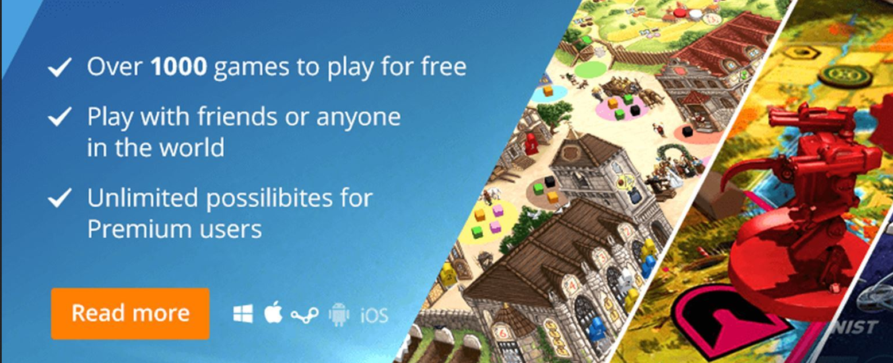
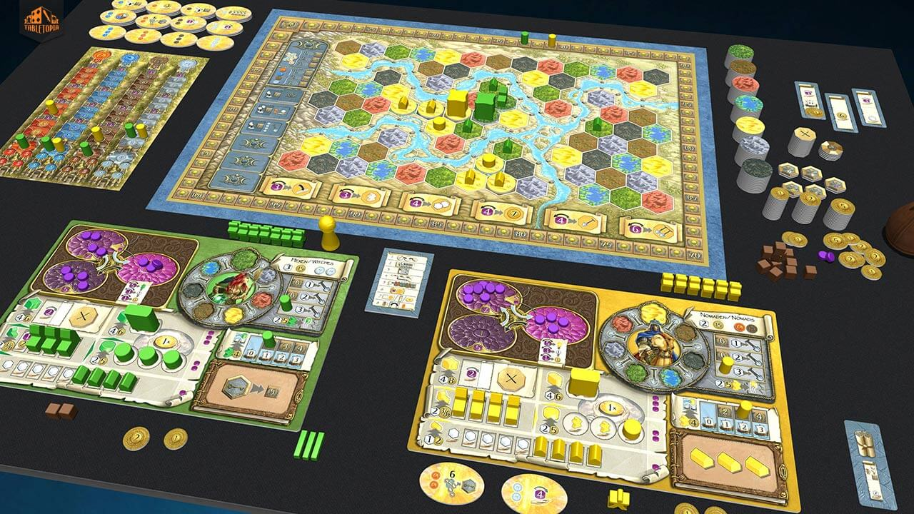

# 今週の進捗 / tabletopiaで自作ゲーム

## 2020.11.29 モチ会 44 回

### tackman

---

# 今週の進捗

## 百合紅拡張「Episodes(仮)」

- 一旦カードリスト作った
- tabletopiaでテストプレイアブル環境作った
  - tabletopiaについてはこの後解説

---

# tabletopiaについて

---

# tabletopiaとは

オンラインボードゲームプレイ用プラットフォーム

### 特徴（特にTable Top Simulatorとの比較）

- サブスクによるゲームデザイナーのマネタイズあり
- マルチプラットフォーム
  - PC Webやスマホアプリ版もある

---

# プレイ感

- Table Top Simulatorと基本は同じ

（公式より引用）

---

# tabletopiaのマネタイズ

### ユーザーサイド

- サブスク課金することで一部の premium games をプレイ可能になる
- 内容により月額$5, $10のプランなど

### パブリッシャーサイド

- サブスク課金額から、プレイヤーのプレイ時間に応じて按分される
- プレイヤーごとにプレイ時間で按分するので、1つのゲームしかプレイしていないプレイヤーの課金はその全額（からプラットフォーム税を引いたもの）がパブリッシャーに入る
  - より中毒性の高いゲームを作った方が有利なルール

TTSでは違法ゲームが少なくなかったが、Tabletopiaは版元公認のものだけ（のはず）

---

# マルチプラットフォーム

- TTSではPC必須だけど、Tabletopiaではだいたいなんでも動く
- ブラウザで動くのでインストール不要
- スマホアプリ版もあるのでPCなしでもなんとかなる
- 基本無料で、有料ゲームも課金プレイヤーの招待でプレイ可能

プレイに誘う敷居がTTSより圧倒的に低い

---

# まとめ

- やろう！Tabletopia
- ボドゲ作ってる人は登録を検討していいのでは？

---

# 参考文献

- https://tabletopia.com/
- Tabletopia マネタイズ
  - https://help.tabletopia.com/knowledge-base/monetizing-games-on-tabletopia/
