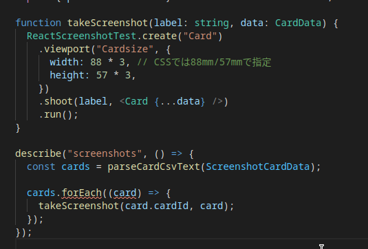
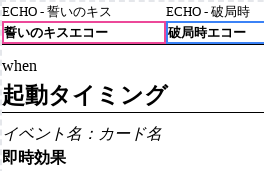

# 今週の進捗 / ボドゲ制作のCI

## 2020.12.19 モチ会 45 回

### tackman

---

# 今週(まで)の進捗

## 百合紅Episodes(仮)

- 一応テストプレイ可能にした
- オフボドゲ会にテストキット持ち込み、テストするぞ！
  - → からの本体持ち込み忘れで不発。マヌケすぎる・・・
- オンライン化でのカード画像生成が面倒だったので自動化着手

---

# カード画像生成の自動化

元からテスト用カード画像をReactでレンダリングするブラウザアプリを作っていた

1. スプレッドシートでマスターデータ作成
2. CSVとしてダウンロード
3. CSVのドラッグ＆ドロップでA4印刷用画面表示

- オフでのテスト用には上記で十分だった
- オンラインツール（tabletopia, TableTopSimulator etc)へのアップロード時はカード単位で画像が必要

---

# react-screenshot-test

- Reactのテスト用ツール
- Reactコンポーネント単位でスクリーンショットを出力できる
  - カードのコンポーネントを出力すれば今回の目的達成
- 裏側は jest と puppeteer
  - puppeteer の導入は意識不要でした
  - jest の設定は多少自分でいじるスキルが必要

---

# コードはこんな感じ

---

# あとは流れで

- 画像出力までできたので、あとはやることやる
- GitHub Actionsあたりで
  - スプシからのデータフロー自動化
  - テストランナー設定する

---

# 参考文献

- react-screenshot-test
  - https://github.com/fwouts/react-screenshot-test