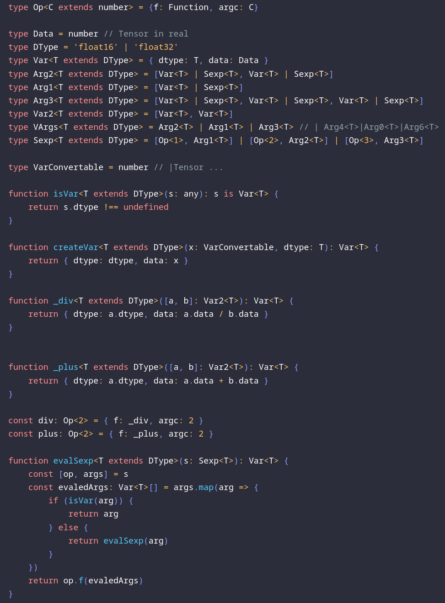

# 今週の進捗

## 2021.01.09 モチ会 47 回

### tackman

---

# 進捗① ゲムマ大阪サークルカット作成＆新刊を計画


## 新刊「リモート時代のボードーゲーム」

- 締め切り駆動です
  - 最低限の記事はここ(こめかみを親指で指す)にあるのでモノはできる、はず
- *執筆者絶賛募集中*

---

# 今週の進捗① TypeScript深層学習

- 思いつきメモをzennのスクラップにまとめてます
  - https://zenn.dev/tkmn/scraps/086181ac3be5bc
- DSL的な部分に関して、とりあえずこれで行こうというメドをつけた

---

# TypeScriptの問題点

## 演算子オーバーロードがない！！

- まさかPythonにある機能がないとは思わなかった（ヘイトスピーチ！）
- 非プリミティブ型で演算を多様する機械学習でかなり不利

```
(x*x + y*y)/2 - bias
```

↑こんな単純な例すらメソッドチェーンでしか書けなくなってしまう

```
x.mul(x).add(y.mul(y)).div(2).sub(bias)
```

ベタに書くとこういうのが不可避になる

---

# 回避策

さしあたりS式モドキは実装できる

```
[sub, [div, [add, [mul, [x, x], [mul, [y, y]]]], 2]] , bias]]
```

Q. これ使いやすいです？
A. (比較的)宣言的に書けるだけ個人的にはマシ

型定義をごにょごにょしてあげることで、静的に引数の個数などのチェックは可能
（次ページのS式モドキのための型定義参照）

---



---

# この次にやること

- TensorFlow.jsのラッパを書く
- まずは自動微分（オレオレAutograd）の実装くらいまでやりたい

---

# 参考文献

- TypeScript playground
  - https://www.typescriptlang.org/play/