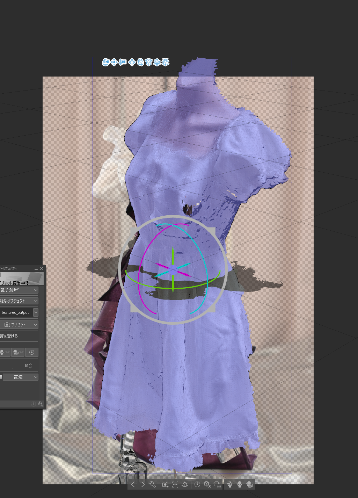

# 今週の進捗 / iPhoneで3Dスキャン使ってみた

## 2020.11.29 モチ会 49 回

### tackman

---

# 進捗① TypeScript深層学習ライブラリづくり

- シコシコ実装してる
- 基本構想や設計は以前書いた通りなので特記事項はなし
  - Node / TensorFlow.jsバックエンドでGPU使って実行できるのを確認したり

追加で気づいたことなどは随時zennのスクラップに追記しています

https://zenn.dev/tkmn/scraps/086181ac3be5bc

---

# 進捗② Rustで簡易画像処理

- 画像系の機械学習の前処理で、crop/resizeだけしたいという需要
  - ただし件数は多い
  - PythonだとIO性能などの問題で辛い思いをすることがある、した
- ライブラリサーベイ中
  - デファクトっぽいimage-rs
  - WebAssembly連携を謳ってブラウザデモもあるphoton
  - （あんまり使いたくないけど）OpenCVもある

使ってみた報告は来週あたりにするかも

---

# 進捗③ iPhone LiDARカメラでお洋服3Dスキャン

## ノンイラストレーターズイラストメイキングシリーズ

### LiDARとは：

- 深度情報などが取れるセンサー系の総称
- iPhoneの最新ハイエンド機種(12proなど)にはLiDARが搭載されている

お洋服を3Dスキャンすれば、イラスト用3D資料として利用できないかという試み

---

# 3Dスキャンしてみた

今回利用したのは 3d scanner app
https://apps.apple.com/us/app/3d-scanner-app/id1419913995

## case1. うちの子（ドール）

#### 「かつて人だった塊のようなもの」ができた

- ドール小さいため、LiDARの精度では上手く形状が取れない模様

## case2. 人間サイズのお洋服をトルソーに着せてスキャン

- こちらは割といい感じに
- やはりある程度の大きさのものに使うものっぽい

---

# 利用例

スキャン → Sketch fubにアップロード → テクスチャつきOBJダウンロード → Clip Studio で読み込み

---

# 課題やわからんところ

- iPhoneのLiDARの精度情報がよく分からない（分かりやすいところになさそう）
  - かるーくしか調べてないので、ちゃんと調べるとあるのかもしれない
  - ArKitのAPIでも精度情報がないっぽい…？
- 自宅にトルソーと女物の服を集める人になってしまう、なった
- 資料にするたびにお洋服買っていると出費で破滅しますね？

この辺まとめてfanboxに溜めつつ、そのうちコミティアでまとめて本にしたい