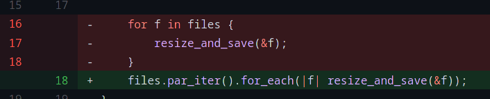

# 今週の進捗

## 2021.02.06 モチ会 50 回

### tackman

---

# 今週までの進捗

## TypeScript深層学習ライブラリづくり

- TSのLteral Typeを利用した型芸の限界に挑戦してた
- 具体的にはテンソル型のshape（N^k空間）を型レベルで導出したかった
- Conv2dなど複雑なケースで四則演算が必要になり手詰まり
  - Babelプラグイン書くしかなくない？となり一旦諦めるべきか

## Rustで簡単な画像処理やってみた

- やっていく中でRustの所有権まわり「完全に理解した」
- rayonで並列処理がめちゃくちゃ簡単に書けて感動

https://zenn.dev/tkmn/scraps/cc57d75599f0af#comment-21ce406a306ece

---

# Rust入門してみた話

---

# 所有権を理解していないと簡単なプログラムも書けない

- 「雑にunsafe連打していいなら適当に書けるでしょ？」と思っていた
- 関数呼び出しが絡んだ瞬間に、所有権を理解していないとコンパイルエラーで咎められる
  - 他言語であまり見ないlifetime parameter構文まわりの理解を強いられる
  - 理解しない限りコンパイル通らないので安心とも言える

所有権は解説コンテンツも充実しているので、恐れることはないはず

- C++触ったことがないと必要性の理解は難しいかもしれない

---

# crates.io の整備状態が良い

- crates.io のWebサイト自体が割とドキュメントとして機能してる
  - 例えばnpmjs.comと比べるとわかりやすい
- いちいち外部サイトを見ないでもAPIリファレンスを見れるので優秀

---

# 言語組み込みのテスト機能が良い

- 言語組み込みなので、使い捨て系でもテストを書く抵抗が少なくなる
  - JSだとここでjest入れて〜config書いて〜で「もうええわ」になりがち

```rust
// main.rs内にベタ書きできる

#[test]
fn test_crop_image_odd() {
    let img = open_image("images/image_0004.jpg").unwrap();
    let cropped = image_crop(img, 57).unwrap();

    assert_eq!(57, cropped.get_height());
    assert_eq!(57, cropped.get_width());
}
```

spec系記法が個人的にあまり好きではないので、その点でもRustのテストは好み

---

# モジュールまわりはなんじゃこりゃ感はあった

- 第一印象としての話
- main.rs/lib.rsというファイル名がハードコード状態で強制
- 解説コンテンツもモジュールまわりは微妙に不親切、舌足らずな印象
- Pythoよりはマシ、node系と同じくらいは微妙

Rust全体的に洗練されているので、その分悪い意味で平凡さが目立つ感じ

---

# エラー処理

- 今どきの言語として当たり前水準はある
  - 当たり前ができてない言語は多いので、これはこれでえらい


エラー伝搬が簡単に書けているという例

```rust
fn resize_crop(path: &str, crop_size: u32) -> Result<PhotonImage, String> {
    let img = open_image(path).unwrap();
    let resized = image_resize(img, crop_size)?;
    let cropped = image_crop(resized, crop_size)?;

    return Ok(cropped);
}
```

---

# rayon 神

### rayon: Rustの並列処理ライブラリの定番

- 手なりでシングルスレッド版を書いたらあまりの遅かったので並列化
- 10分で3行ほど書き換えるだけで並列化完了、コア数倍の速度になって感動



---

# 開発環境の話

## VSCode + Rust analyzerおすすめ

- 言語サーバはRLSとRust analyzerがあるが、RLSは挙動が微妙
  - 遅かったり動作不安定になったり
- ヒント表示やボタンクリックでテスト実行などIDEとして強い

---

# Rust、良かった

- 気持ちよく書ける環境が揃ってる
- こわくない