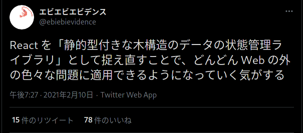

# 今週の進捗

## 2021.02.13 モチ会 51 回

### tackman

---

# 今週やったこと

### ヘクスタイル生成アプリ作った https://hexgenerator.web.app/

- https://github.com/tackman/hexgenerator/
- ボドゲ制作で欲しくなったので、pixi.js の勉強がてらに

### うちの子（ドール）をただ流すだけ配信

- 「100時間まわりんぜ」的なのをやってみたかった
- 手元にあったWebカメラと照明器具で、とりあえず配信してみた
  - 解像度、明るさ、きれいさで課題は見えた
  - 真面目にやると機材投資不可避っぽく、悩ましい

### ゲムマ大阪・春向け執筆系作業

- 詳細はそのうち

---

# ヘクスタイルアプリ作ったレポ

---

# React PIXI https://reactpixi.org/

 https://twitter.com/ebiebievidence/status/1359448785630359556

### Reactのコンポーネントスタイルでpixi.jsを使うためのラッパーライブラリ

- ReactがDOMの世界の外でも有用な例がまた一つ

---

# React PIXIのここがいい

- <Sprite>や<Stage>などをReactコンポーネントとして表現可能
- 状態管理（ContextやHooks）もReactに乗れる
- create-react-appで作ったテンプレートにそのまま追加できたりした

以前紹介した Three.js のReactラッパーライブラリ、react-three-fiber と同様の利点

#### チラ裏

BGEngine的なものを作るのに生の pixi.js だと大変そうだなーと思っていたけれど、
React PIXI なら文化的にやれそうという手応えがあった

---

# Firebaseママの介護がすごくて赤ちゃんになる

デプロイ先は  Firebase Hostingを選択

- SPAまわりの設定などで手や脳を使いたくなかった
- .web.app というかっちょいいドメイン使える

#### firebase init したら面倒見が良すぎてびっくりした

1. ウィザード形式内で、Firebaseデプロイに必要なOAuthやってくれる
2. GitHub Actions での継続的デプロイ設定ファイルまで生成してくれる

無から1にする時の面倒を見てくれるので猛烈に楽

---

# 参考文献

- https://github.com/pmndrs/react-three-fiber
- モチ会 04回発表 http://tech.tackman.info/mochikai/04/#9
  - react-three-fiberの紹介をした