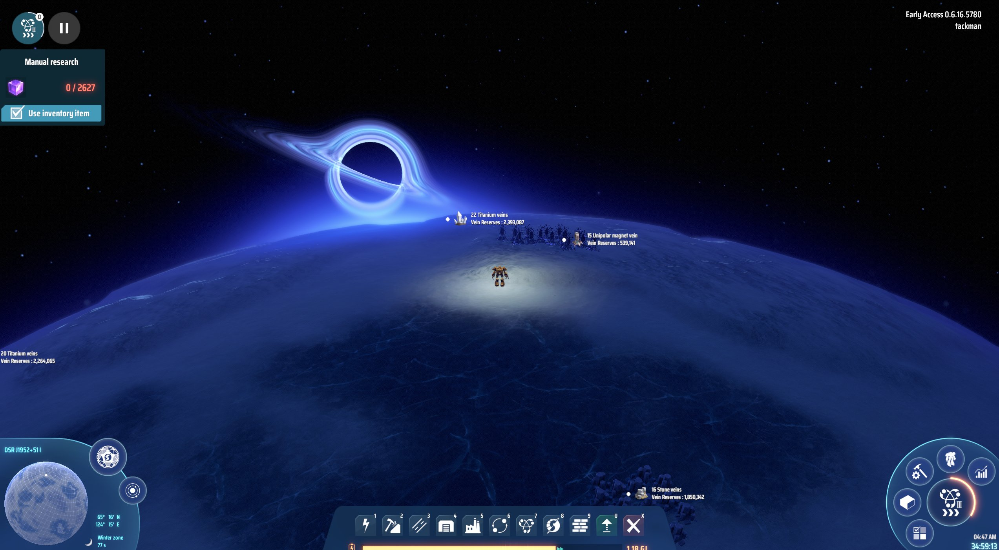
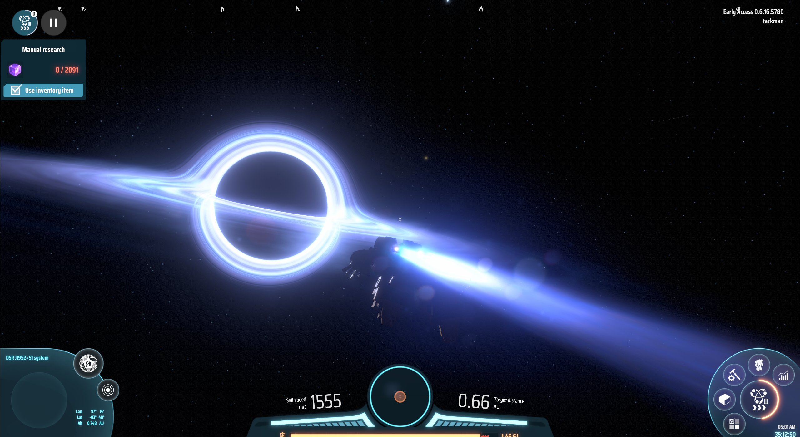
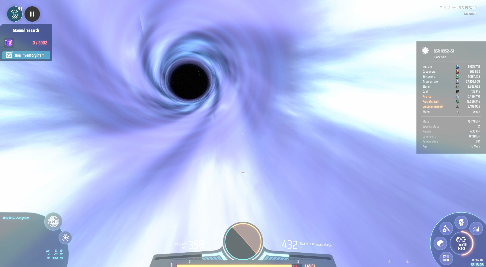
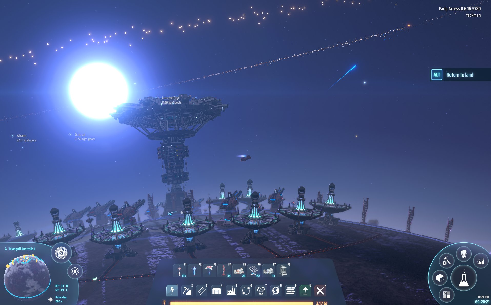
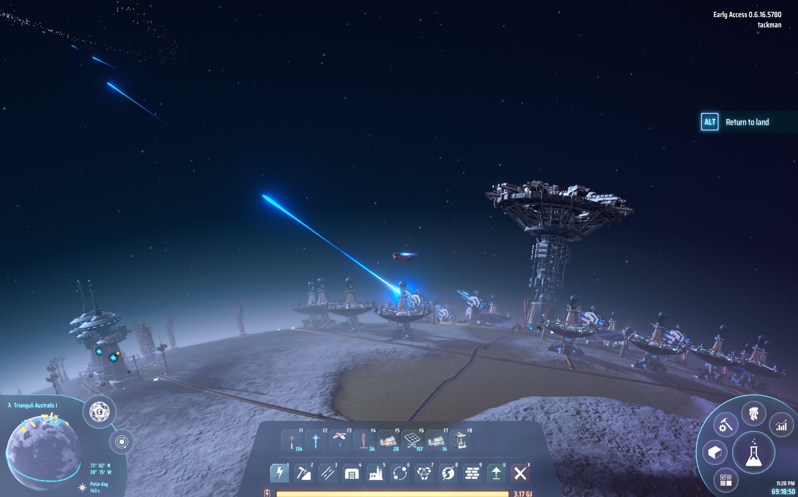
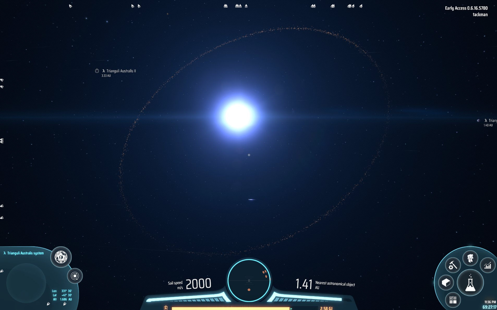
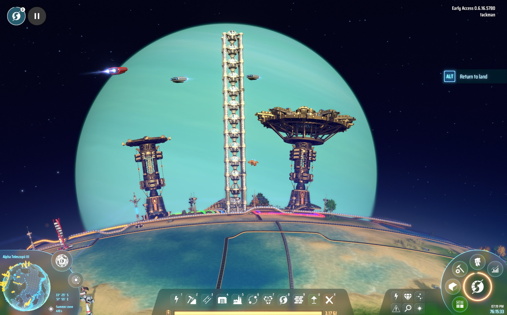

# 今週の進捗

## 2021.03.06 モチ会 53 回

### tackman

---

# 今週までの進捗(?)

## Dyson Sphere Program を Mission copmlete

https://store.steampowered.com/app/1366540/Dyson_Sphere_Program/

- 3月の可処分時間を前借りしてクリアしました

## JSでのデータ可視化

- MLやるならpyplotやgraphviz的なことやりないよねって
- 思ったよりこれだというライブラリがなく、ライブラリ選定で半日溶けた
- Reactネイティブなvisxがよさそうな感じ
- ライブラリ選定で時間切れになったので、使用報告はまた今度

---

# フロントエンドのデータ可視化ライブラリ調べた

- D3.js: ド定番だけど生DOM触る設計が今だと微妙
  - とは言えラッパーや後発では出来ない自由度があったりする
- C3.js： D3.js ラッパー。D3のうち一部機能でいいならこれもアリかも
- plotly.js: D3ベースで多分今一番メインストリームな感じ。元商用
  - PythonやRと互換性があるのはえらい
  - 3Dグラフなど競合と比べて一番機能豊富、だと思う
- Chart.js, Chartist.js ： 棒グラフとか描画するだけならこれでいいと思う
- Victory, Rechart： Reactベース。やれることはChart.jsと同様ぽい
- 番外 HighChart: 商用。個人で使うのは厳しそうだけど評判はよさげ
- visx: ReactベースでD3並の自由度。要件的に今回はこれを採用してみる

---

# Dyson Sphere Program の紹介

---

---

---

---

---

---

---

# ゲーム的な内容紹介

VR世界に引きこもった人類向けのエネルギー供給のため、ダイソン球を作る任務！

- 懲罰労働か？

### ジャンル：工場ゲー

- 要はFactorioの系譜
- ベルトコンベアを引き回して複雑な生産チェーンを組み上げていく

惑星クラスの工場を作り、ダイソン球を作っていくゲーム

---

# Factorioとの違い

- 開始惑星以外の惑星へ、星間航行して入植できる
  - 最初は星系内の他惑星へ、ゲームが進むとN光年先へワープして行ける
  - 本星同様に開発可能、そういう惑星が3桁単位である
- 地上の工場建設部分はFactorioより若干単純化
  - 原油などの「液体」カテゴリがなく、全部ベルトコンベアで運べる
- ただしベルトコンベアは三次元化していて、その気になればすごい構造を組める
- バイター（敵性存在）要素はなし。のびのび入植
  - ゲーム的にはぬるいポイントだとは思うけれど、好きに拡張できるのは楽
  - 将来バージョンで敵性存在の実装構想はあるらしい

---

# 作ろう、ダイソン球

- きっちり工場ゲーしているので電子ドラッグ
- 宇宙ヤバい
- SSのように、宇宙のグラフィックで抜ける

Steamの早期アクセスで2000円ほど、買い得です