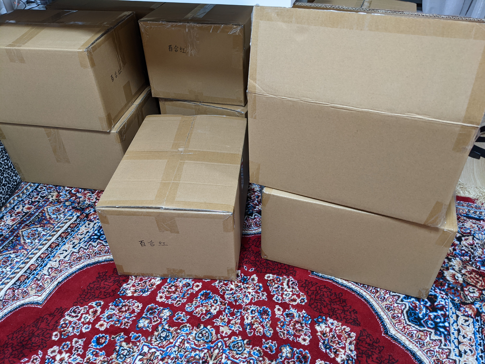

# 今週の進捗

## 2021.05.15 モチ会 55 回

### tackman

---

# 休みボケからのリハビリ期間

- GWに直接関係ない身分だけど、諸事情で休みボケしていた
- 溜めてた事務的なアレを一通り片付けたりはしていた

一応やったこともあります（次ページから）

---

# やったこと① 百合紅の増刷が来た

自宅にできた在庫の山（一部）

---

# やったこと② オレオレ競馬アプリ本格着手

### したところ、ついででやりたことが芋づるしてる

- React本体のHooksだけで回すにはデータが複雑だな
  - → Recoil入れなきゃ
- 脳死実装で非効率なレンダリングに耐えられなくなってきた
  - → データ設計に頭を使い始めた
- これモナドにしたいよなあ
  - fp-ts導入しなきゃ
  - ついでに Category Theory for Programmmers も読もう
- CSS　沼
  - 普通に律速段階になっているのでいい加減向き合う覚悟

---

# 手段が目的と転倒する典型的なアレになってる

- 歳取ってこれをあまりやらなくなっていたので、久々にやってみるかの気持ち
- 作っているアプリの規模自体は大したことないので、焦る理由もない（はず）

---

# 参考文献

- Recoil https://recoiljs.org/
- fp-ts TypeScript 関数型ライブラリ
  - モナドとかしたりするアレ
  - https://github.com/gcanti/fp-ts
- Category Theory for Programmers
  - https://github.com/hmemcpy/milewski-ctfp-pdf
