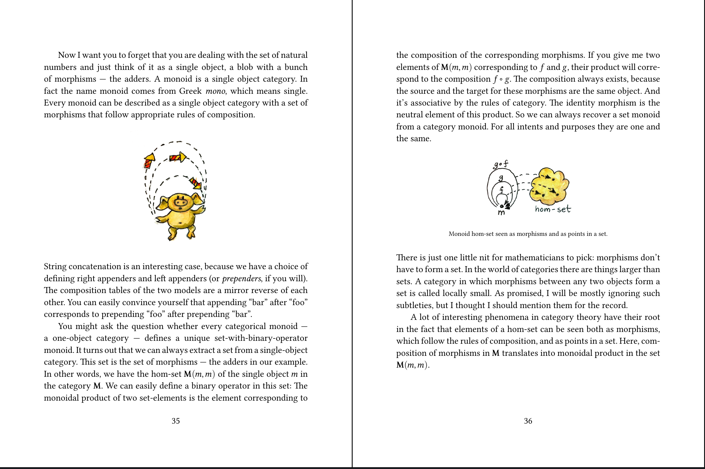
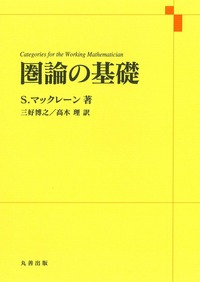

# 今週の進捗

## 2021.05.22 モチ会 56 回

### tackman

---

# やったこと

### Category Theory for Programmers 読んでる

- 今で半分弱ほど
- 今週マジでこれくらいしかできてない

---

# Category Theory for Programmers 読書録

https://github.com/hmemcpy/milewski-ctfp-pdf

- 通読できてないですが、どういう本か理解はできたはずなので一応ご報告
- 私自身は圏論もHaskellも未経験者です
  - 圏論はマックレーン本で挫折する程度の能力
  - Haskellは一応読める、バリバリ書いた経験はなし

---

# 0. 英語版しかないようです

- やさしい英語で書いてくれてはいます
- 技術文書を英語で読める程度の英語力は必要
- 専門用語が日本語だとどれのことなのかは調べる必要あり
  - Morphismは射、Initial Objectは始対象とか
  - 副作用で英語での圏論用語を覚えられはしました

---

# ①タイトルに偽りなし

- 本当に「プログラマー向け」
- 数式は本当に控えめ、出てきてもすごく懇切丁寧
  - 数学デキル人が言う懇切丁寧どころでなく、ド文系でも大丈夫なレベル
  - コンピュータの技術書読めるなら確実にOK
- 逆にサンプルコードまわりはコード読み慣れてる人向けの記述
  - 「要はこういうこと」をコードで示している
  - HaskellとC++なので、どちらも未経験だとちょっとつらいかも

圏論とプログラミングのうち、プログラミングだけは経験ある人向け

---

# ②(ページ数が)厚くて(密度が)薄い本

- 重要概念を紙面多く費やして説明してくれている
  - 洋書に多い「厚くて薄い本」スタイル
- 「密度が薄い」と言うのは必ずしも悪いことではない
  - 数学書の高密度に耐えられない一般人類向け
- 和書だと「薄くて薄い本」が多いけれど、これだと内容自体が過小になりがち
  - 内容量 = 密度×ページ数 の法則

---

# モノイドに関する説明の章(一部)



---

# マックレーン本だと

```
モノイドは対象が一つの圏である。よって各モノイドは、すべての射の集合、恒等射、射の合成の規則により決まる。
どの二つの射も合成できるので、モノイドは結合的で恒等元（＝単位元）を持つ二項演算 M×M → を伴う集合Mとして記述できる。
よってモノイドは単位元を持つ半群そのものである。任意の圏Cと対象 a∈C について、すべての射 a→a からなる集合 hom(a,a) はモノイドである。（p.12）
```

6行でさらっと説明されている内容

---

# 補足：マックレーン本とは



https://www.maruzen-publishing.co.jp/item/b294317.html

---

# どちらがいいというものではなく、それぞれ利点のある記述方法

- 独学で勘所を教えてくれる（冗長な）記述
- 端的にどういうことなのかが圧縮されている記述

私の場合は、

1. Category Theory for Programmers をまず読んで
2. 該当部分の説明をマックレーン本で確認

---

# ③ところでプログラマーが読む価値があるの？

- あると思いました
- モナモナしてる感じのコードは、具体例だけを見てもどうしてそうするのか分かりづらい
  - → 急がば回れで体系的な勉強はした方がいい
    - 帰納的にこの辺理解できる人は、普通に圏論の勉強しても一瞬で終わるはず
- ネットや日本語文献だとイマイチなものが多いけれど、本書は良いです
  - 圏論の教科書自体は名著の邦訳があるけれど、プログラマー向けではない

「中級者ギャップ」を埋めてくれる最適な本だと思います
