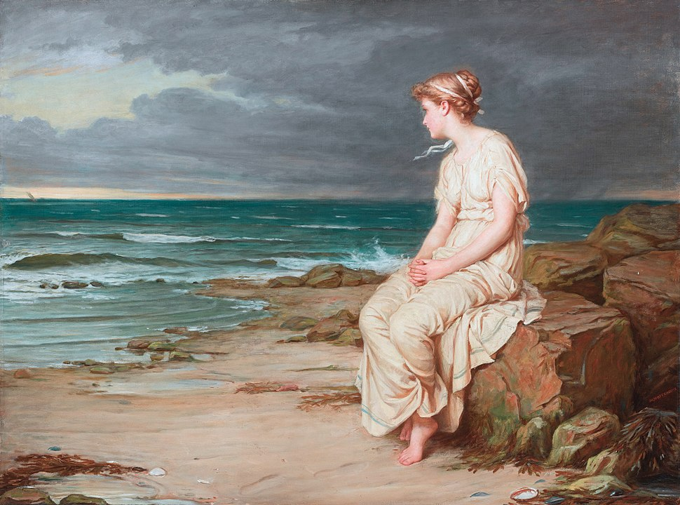

# 今週の進捗

## 2021.05.29 モチ会 57 回

### tackman

---

# やったこと

- Category Theory for Programmers 一応通読（先週の続き）
  - マックレーン本と「ベーシック圏論」で対応する部分も一応目を通した
  - ところどころ飛ばし読みをしたので理解度50%くらい
  - fp-tsのAPIを見て「ああアレね」となる程度には効果はあった
  - 一週間くらいで読み返していると頭に入りそう
- ↑読了したのでオレオレWebアプリの開発を再開(WIP)
  - これという形で出せる進捗はないけど、やっています
- 思いついたことがありデータセット作成に着手

---

# Fine art datasetが欲しくなった

こういうやつ

https://en.wikipedia.org/wiki/John_William_Waterhouse より

---

# きれいなデータ5000〜10000点程度が欲しい

- 根気さえあればなんとかなる範囲、のはず
- クリーンなデータセットである価値が高いので、雑なクローリングではダメ

純粋に手間と時間の勝負になるので、一ヶ月くらいかけてちまちま進める予定

---

# 参考文献

- Category Theory for Programmers
  - https://github.com/hmemcpy/milewski-ctfp-pdf
- fp-ts https://gcanti.github.io/fp-ts/
- 圏論の基礎 （マックレーン本）
  - https://www.maruzen-publishing.co.jp/item/b294317.html
- ベーシック圏論
  - https://www.maruzen-publishing.co.jp/item/b295027.html