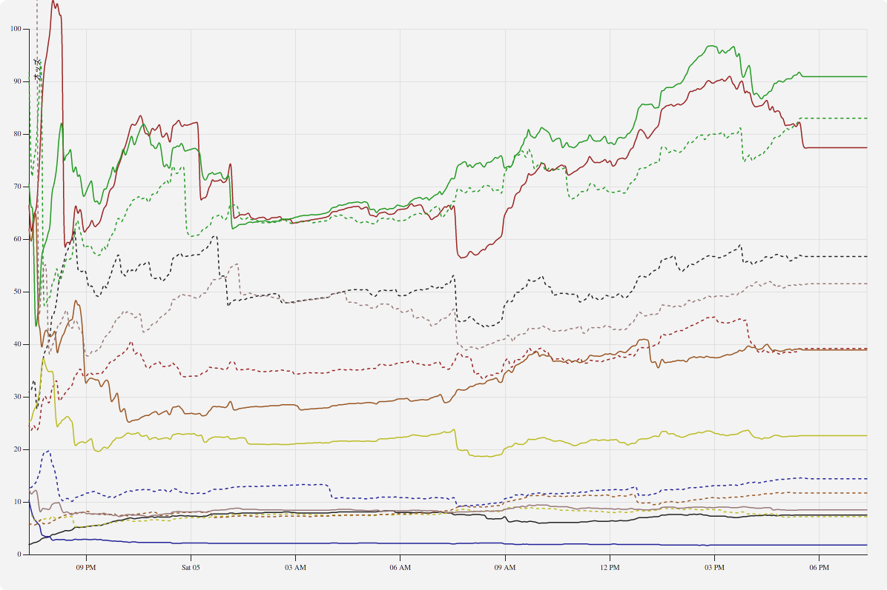
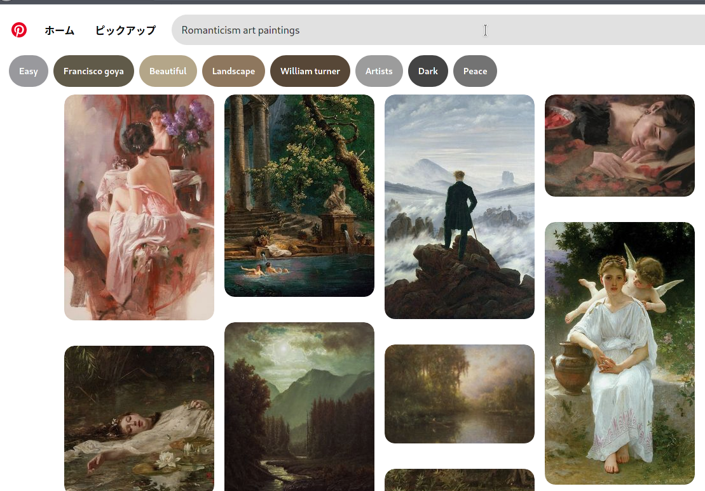
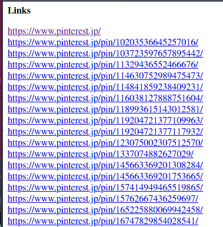

# 今週の進捗

## 2021.06.05 モチ会 58 回

### tackman

---

# 今週やったこと

### JRAからオッズの自動取得をするシステム組んだ

ついでにグラフでの可視化もしてみた

- サンプル https://keibaforio.web.app/race/chart.html

### Fine art datasetづくり

劇的に効率アップできそうな手法を見つけた

---

---

# やってること

1. JRA公式のオッズのページをゲット 
   1. なおHTTPリクエストはPOSTの模様
2. jsdomでパース
3. Firebase(Firestore)に保存

以上をFirebase Cloud Functionsで定期実行
フロントエンドはFirestoreからログを取得、visxでグラフ描画

---

# Tips

- fp-ts全面導入でそこそこ安心感高くコードが書けた
  - Functionsの定期実行はテストがしづらいやつだけど安心できた
- FunctionsはGCP本体版とFirebase版がありますが、Firebase版の方が楽（個人の感想です）
  - Firebase版Functionsを使うためだけにFirebaseプロジェクト化するのもアリだと思ってる
- visxは割と何でもできるけど、その分コーディング量多めな印象
  - ドキュメントはやや貧弱
  - 設定系でD3参照してね！というのもちょくちょくある
  - とはいえReactベースでこれ以上のライブラリがなさげ

---

# Fine art dataset作成

pinterestが超優秀なことに気づいてしまった

---

# やり方

画面を開いた状態で、リンク取得するブラウザ拡張を使えばページ一覧のできあがり

- https://addons.mozilla.org/en-US/firefox/addon/link-gopher/

あとはページごとにスクレイピングができる

---

# Q&A

### 完全自動化/ヘッドレスブラウザのみで実現できない？

いくつかの理由で有人ブラウジングを挟んだ方がいいと判断

- pinterestはユーザーごとに表示をカスタマイズする
  - ボットでやると予想しない結果になるかもしれない
- 検索結果が望ましいかは都度人間の判断が必要、かつ基本的に一度きり
  - 自動化の恩恵が薄い

### PinterestってAPI提供してない？（なんでスクレイピング？）

- まず申請が必要
  - TwitterやFacebookのように、App作成即利用とはいかない
- ユースケースがエンドユーザー向けにアプリケーションを提供するものしかなかった
  - 開発者が手元でゴニョゴニョする用途は想定していない模様

---

# 参考文献

- fp-ts
  - https://gcanti.github.io/fp-ts/
- jsdom
  - https://github.com/jsdom/jsdom
- visx
  - https://airbnb.io/visx/