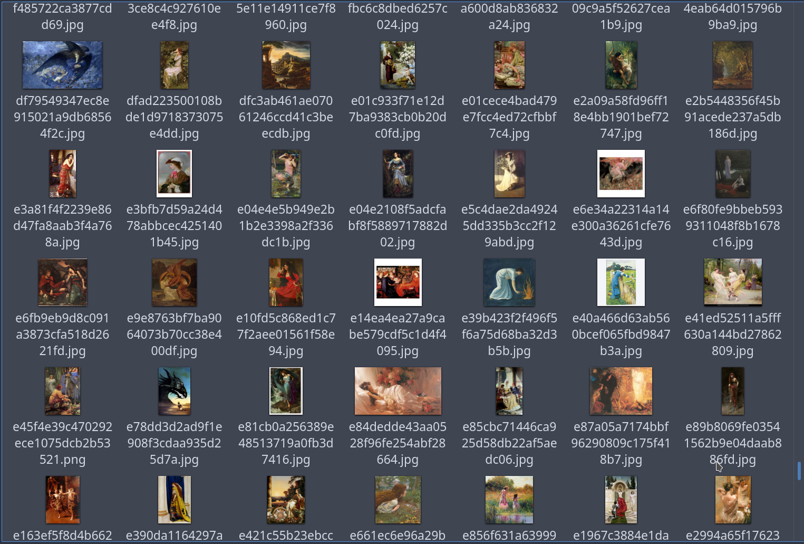

# 今週の進捗

## 2021.06.19 モチ会 60 回

### tackman

---

# 今週やったこと

### ファインアート データセット作り

- 先週から引き続き
- 実際にちょっとデータを集めてみた（〜1000件程度）
- 集めながら自作ツールを少しずつ改良、ドッグフーディング
 
※ドッグフーディングとは：
"Eating your own dog food" より。
自分で自分の作ったものを使って改良していく行為
https://en.wikipedia.org/wiki/Eating_your_own_dog_food

---

---

# 前回から修正したところ

- 同一URLに対して unique key 相当になる処理を追加した
  - Firestoreの仕様上、GETしてからPUTをするようになった
  - → 直PUTで書き込み失敗をする謎バグもついでに回避（詳細は前回発表）
- 送信完了状態が分かるようにフロント側をいじった
- 画像を取得するバッチ処理部分で、時間あたりの処理上限のソフトリミット設定
  - 万が一にもアクセス禁止は食らいたくないので、念のため

---

# 実際に使った感覚

- 1〜2時間程度で（ゴミ取り前の）1000枚が集まる
  - 2営業日程度で目標の1万点が揃えられるのでは？
- 試験走行で、これで行けそうという感触
  - 考えるのをやめてひたすら走る(作業をする)フェーズへ

---

# 来週の見込み

- とりあえず1万点を目標に集めきる
- 別のデータセットも集めたい
  - 今のところ Real clothes dataset で考えている
- データセット集めがやり切れたら、ありもの実装で学習回したい