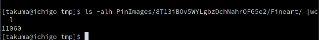

# 今週の進捗

## 2021.06.26 モチ会 61 回

### tackman

---

# 今週やったこと

## Fineart Dataset作成

当初目標の約1万点を集めた

今週の進捗、以上！ｗ

- あとCVPR2021で、やりたいことに関連しそうなやつのピックアップはした

---

# 半手動でデータセット1万点を集める

1. Pinterestで検索、目視で目当てのものになっているか確認
2. リンク抽出ツールでPinのリンク一覧を抽出
3. 自作ツールにリンク一覧を流し込み画像を保存

検索一回で20〜100件ほどが拾える
画家の名前で検索すると効率が良い → 画家の名前を検索するゲーム性に

---

# 完走した感想

- 似たようなモチーフのものが多くゲシュタルト崩壊しがち
  - ファインアートの定義からして当たり前ではある
- 印象派がなぜ印象派なのか視覚で理解できてきた
- 19世紀の画家の名前に詳しくなれる
- 萌え絵師のやってることは19世紀から変わらないなとわかる
  - 光沢フェチおじさん http://www.artnet.com/artists/vittorio-reggianini/

ファインアート集め、割と恥ずかしい趣味なのでは？となった

---

# 今後の予定

- ちょうどCVPR2021の時期なのでざっと目は通す
- pix2pixHD（画像変換手法で有名なもの）の後継手法がないか探す
- 衣料の実写画像1万点も同様の作るかも

※CVPR：コンピュータビジョン（機械による画像認識）系のトップ国際会議
 狭義のCVに限らず画像生成なども近年は盛ん

 ---

 # 余談

 # ポケモンUnite楽しい

 https://www.pokemonunite.jp/ja/

 - Switch用、ポケモンでMOBA
   - MOBA=League of Legendsなどのジャンル
 - 開発元はテンセントらしい、中国ゲーム強い
 - LoLと違って1ゲーム10分で終わって健康的
 - LoL未経験勢でも楽しめてる

「全裸中年ピカチュウ」「陰湿な殺人ネズミがよお〜」「死ねピカ」などの名言が出てくる