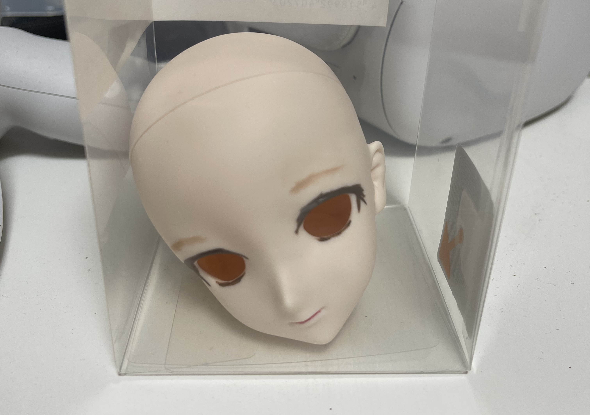

# 今週の進捗

## 2021.08.07 モチ会 64 回

### tackman

---

# やってる①：3D画像ビューア

- Three.js / react-three-fiber 
- テクスチャ読み込みでクラッシュしたりしてる・・・
- 同じコードで動いたり動かなかったりが発生してる、つらい

---

# やってる②：SinCUTで画像変換

- うちの子の写真-ファインアートで変換実験中
- あまり上手くいってない
- GCPで回しているので、1回1000円のガチャ
  - 自宅のGPUで回すより手が止まりがち
  - グラボ買い戻したくなってくる

---

# やってる③：ドールヘッドのメイク

---

# 今回から使ってるもの

- 100均で売ってるメイク道具
- 眉をこれにパステルチョークをつけてやってみてる