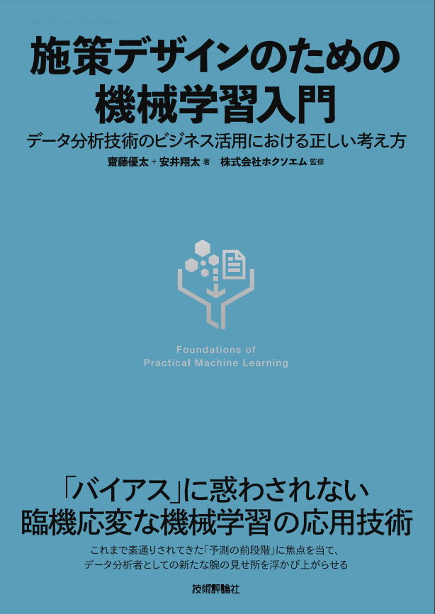
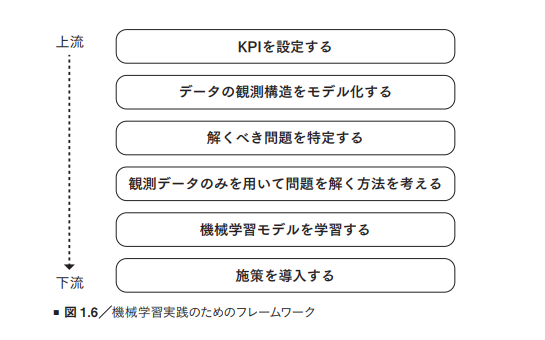

# 今週の進捗

## 2021.09.04 モチ会 68 回

### tackman

---

# 今週の進捗

- 作業的な部分では無
- 機械学習の神な本を下読みしたので紹介

---

# 施策デザインのための機械学習入門

https://gihyo.jp/book/2021/978-4-297-12224-9

---

# 対象読者

- 機械学習の基礎知識とプログラミングスキルは前提
- 仕事で機械学習をやる人が欲しいことが詰まっている
- 数式出てきても平気 or 頑張れる人
  - ビジネスの人が買って数式リアリティショックを受ける程度ではある
  - 理工系の本として見ると数式控えめ概念多め
- 初級から中級くらいのデータサイエンティストにたぶん最適

---

# 特徴

- フレームワークによるトップダウンアプローチ
- 問題の形式化を数式をそこそこ使ってきっちり表現している

1章 p.18より引用

---

# 感想

- 手法やツールの使い方を紹介するだけの本とは一線を画している
- 類書は日本語の本ではない、英語でもあまりなさそう
- このレベルのものを日本人が日本語で出してきているのは本当にすごい
- 技術書は中級者向けの本が一番難しくて需要があって供給が少ないと言われるけれど、見事にそこに刺さっている

機械学習を仕事でやる（可能性のある）人はマストバイ

---

# その他

10億年ぶりにTRPGをやることになって、脳死キャラメイクのためWaifLabsガチャ

久々にWaifLabs使って気づいたけど、現代風で可愛い顔になる絵柄がほぼ一種類しかない気がする。令和の絵柄の源流がそこだけ入っていた…？