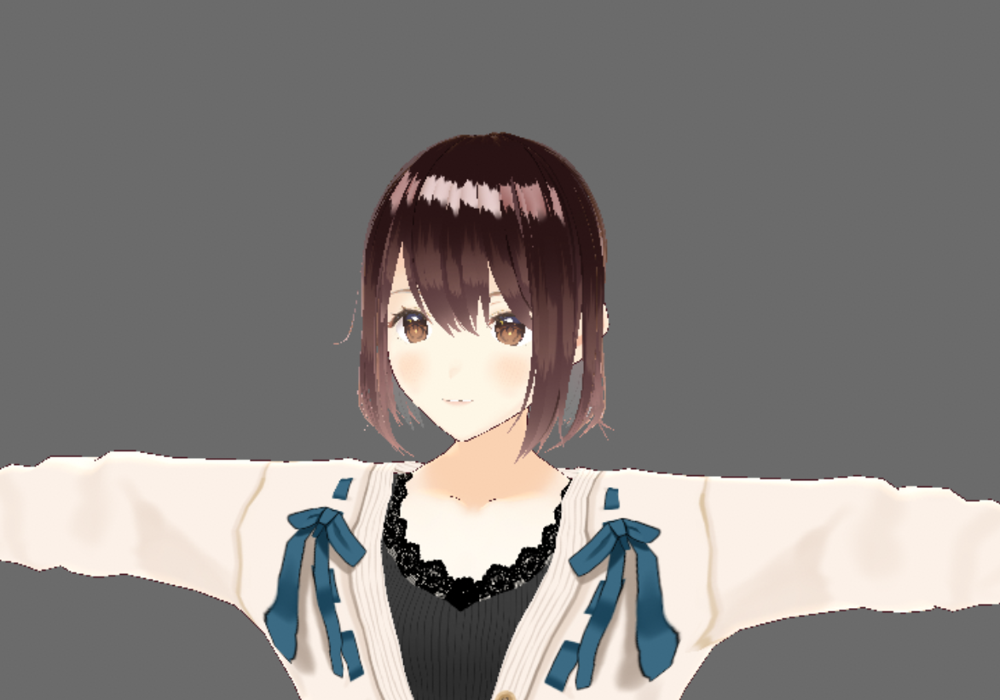
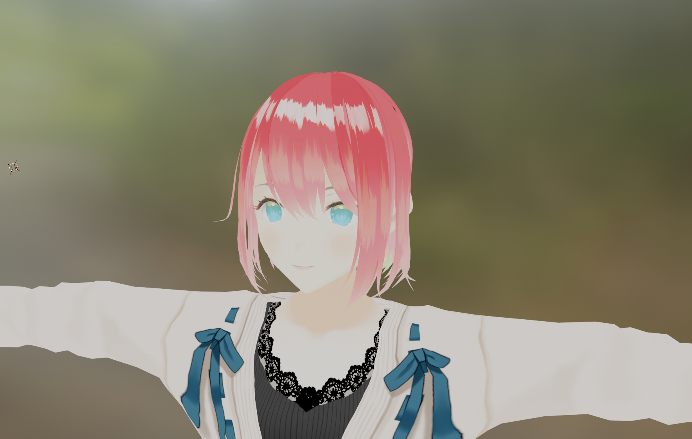

# 今週の進捗

## 2021.09.18 モチ会 70 回

### tackman

---

# 今週やったこと

全体的にBlenderとの和解プロセスを始めた週だった

- VRoid -> Blender の制作フロー検証
- Painting VR触ってみた

---

# インスタントに人型3Dモデルを作りたい

- Blenderでスクラッチするのは言うまでもなくキツい
- カスタムキャスト系はライセンスを見る限り自由に使えない
- VRoidはライセンス的には使えそうだけど、制作上の自由度に不安

→ VRoidでモデルをVRMエクスポート、Blenderで読み込んで改造しよう！

---

# VRM Add-on for Blender

https://github.com/saturday06/VRM_Addon_for_Blender

- ちゃんと最新のBlender2.9でも動いた、メンテもされてる
- アドオンインストールするだけでVRMが読み込めた
  - 見る限りテクスチャやシェーダの破滅はしてない
  - ボーンはちゃんと見れてない

---

# VRoidデフォルト子

---

# クリスタで髪色塗った

外部ツール使えるとテクスチャペインティングははかどりそう

---

# Blender触った感想

- dアニメを流しながらVRoidとBlenderを触るとFPSが落ちる
  - ちゃんとGPU使ってるんだなって謎の感動をした
- 最近のBlenderはだいぶ初心者フレンドリーになってる？
- スカルプト機能が次世代型初心者の進む道なのかもしれない
  - ただ現状日本語圏にある情報はローポリが基本の模様
  - 公式だと初手でスカルプトのチュートリアル動画があったりする
    - Blender運営的に推していきたいのはこっち？

---

# その他

---

# Painting VR（Oculusアプリ）触った

https://www.oculus.com/experiences/quest/3106117596158066/

- 仮想巨大壁面にばさーっとドローイングしていくアプリ
- ドローイングの体験としては非常に良い
  - 壁に筆が接触した時にコントローラが振動する
    - 板タブ液タブに欠けていたのはこれなのでは
- これ自体は「ペインティング」に寄っているので
  - イラストレーション向けの他のアプリの登場も期待

---

# やるやら

- Pleroma立てるタスクを積んでいる・・・
  - mastodonからの移行を考えるだけで手が止まっている
- 20兆年ぶりくらいにコミティア一般参加予定
  - 刺激駆動

