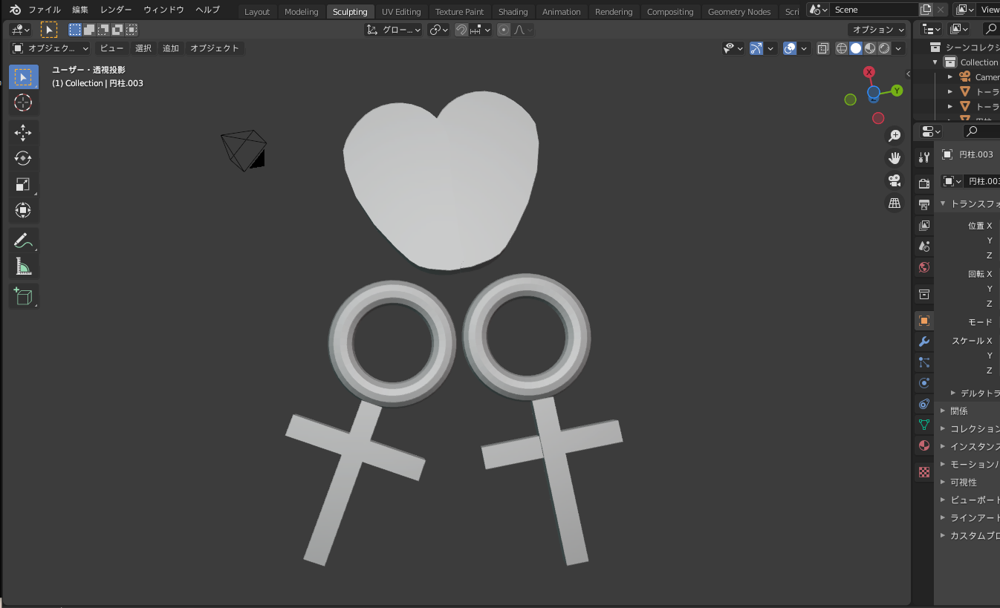

# 今週の進捗

## 2021.10.16 モチ会 72 回

第何回か正確に分からなくなってきたので自分が参加した分だけカウントアップすることにした

### tackman

---

# 今週の進捗

Blenderとの和解を模索

Blender講座をBGVにしながら作っていたけど、自分がこれだけやる間に講座は剣とか建物が出来上がっていた

---

# やろうとしてること

百合紅コンポーネントの3D版を作ってみたくなった

↑これ

---

# 3Dプリント

- グラフィック社で3Dプリントサービスがある
  - 1つ1000円前後からいけるっぽい https://www.graphic.jp/price/5219_1316_1944/
- 秋ゲムマで少量持ち込んでみたい

---

# 未来

- 人型アバターのモデリングやりたい！
- ドール向けのアイテムを3Dプリントしたい！
- そうでなくても3Dアセット作れる状態になっていたい！

でも現状のBlender筋が足りなすぎる・・・
→ モチベーションが湧く & 簡単なものをもっと数をこなしたい