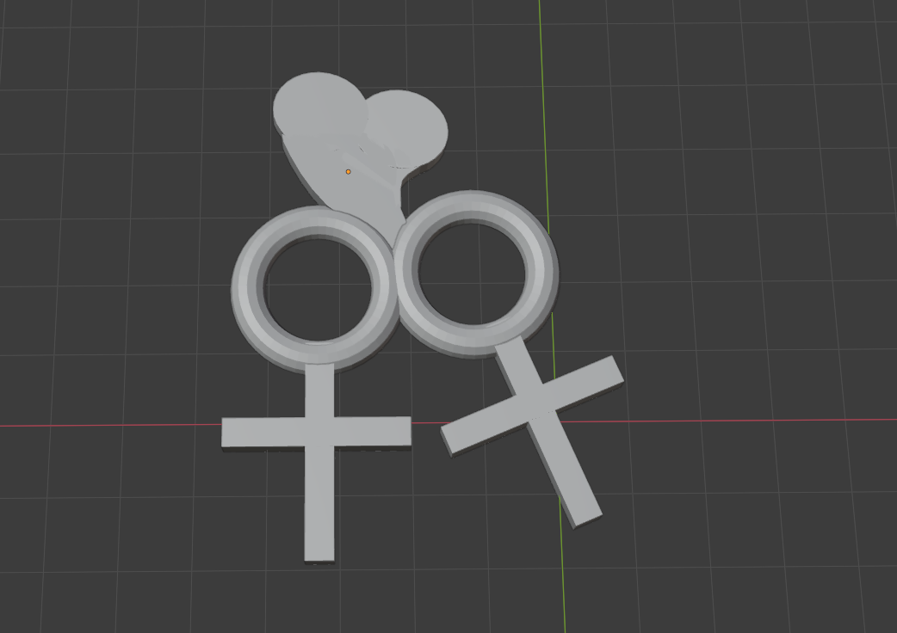

# 今週の進捗

## 2021.10.23 モチ会 73 回

### tackman

---

# 今週の進捗

Blender君と仲良くしたい

3Dプリント時に何が起こるのか把握していない点が多いので、ここで一回出力したい

- トーラスがどういう感じで出力されるのか
- スムースシェーディングってプリント時に意味ないのでは？など

---

# Colab Pro 試してみた

## Google Colabとは

- Pythonを対話的に実行できるNotebook
- 無料・Pro・Pro+のプランがある
  - Proで月額約1000円
- GPUも使えたりする

GPUを使う実行環境としてColab Proが良いと聞いたのでお試し

---

# Colab Proの使用感

- Pro以上プランにはターミナル機能がついてくる
  - が、pingが異様に重い
  - GCPインスタンスだとオレゴンでももうちょっと速いので、もっと遠い場所まで行ってそう
  - 基本はあくまでNotebookを使うサービスで、ターミナルはオマケと思った方がよさそう
- 普通のPythonプロジェクトを実行させるの、ダルくないですか…？

---

# Colab Pro vs Compute Engine vs 自宅サーバ

||Colab Pro|Compute Engine|自宅サーバ|
|---|---|---|---|
|費用|◎ 月1000円ぽっきり文句なし|△　従量制|△　電気代はそこそこ|
|性能|？　カタログ上は良いGPUがもらえるが・・・|◎　金次第|○　GPUは民生用のみ・IO等は高速な傾向|
|手間|×　一定時間でタイムアウト等制約多し|◎|○　パソコンいじりが苦にならなければ
|暖房|×|×|◎ 冬場に回すと室温が数度上がります|

