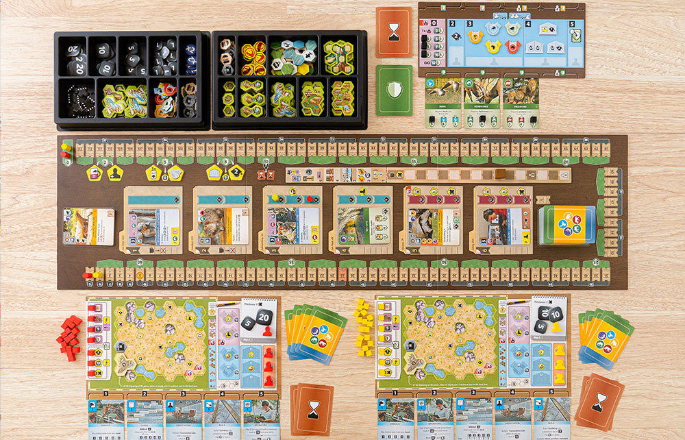

# 今年が残り50日あまりしかない現実を認めたくない回

## 2021.11.06 モチ会 75 回

### tackman

---

# 今週の進捗

- ♀♀アイコン立体を入稿してみた
  - 納期10営業日なので出来上がりは見てのお楽しみ
- Ark Novaやってボドゲの機運が高まった
  - Spiel新作、オンラインで1プレイ3時間くらい
  - メカニクス全部入り状態でゲームが成り立っていて学びがある

---

# Win10/11は標準3DビューアでFBXを見れる

---

# Ark Nova の紹介

モチーフは「君だけの最高の動物園を作ろう！」

画像は公式サイトより https://capstone-games.com/board-games/ark-nova/

---

# メカニクスのリストアップ

- 共有デッキでカードゲーム（ex. テラフォーミングマーズ）
- プレイングによる変動性ゲーム終了タイミング（ex. ハートオブクラウン）
- ワーカープレイスメント（ex. アグリコラ）
- アクションスロット方式（ex. Civilization: Another New Dawn）
  - アクションカードのアップグレードもある（同上）
- 秘密のゲーム終了時目標（ex. ウイングスパン）
- コスト傾斜つき公開カードマーケット（ex. センチュリー：スパイスロード）
- パーマネントタグによるアンロック（ex. 宝石の煌き、テラフォーミングマーズ）
- 個人ごとのボード開発（ex. タペストリー）
- 不定期インカム方式（ex. タペストリー）

---

# Ark Novaにないメカニクスの例

- 交渉要素
- 相互干渉するボード、陣取り要素
- 直接攻撃をするアクション（いわゆる軍事）
  - 一部に攻撃用カードはあり、ウイングスパンやテラフォーミングマーズよりは攻撃頻度は高め
- インスタント・タイミング
- グローバルパラメーター

交渉や軍事が入ってこないのは現代のゲームという感想

---

# 何がすごいのか

- これだけ全部入り当社比でも重ゲーにも関わらず、プレイ体験が良い
- 序盤に崩されて4時間座るだけということが起きない（多分）
- 個別のメカニクスは全部見たことがある、けれど全く新しいゲーム
  - 重ゲーを作る時の戦略の一つとして示唆的
  - 重ゲーは一つのメカニクスで成らず

---

# Tabletopiaで今すぐプレイ

- https://tabletopia.com/playground/ark-nova-ijq1hu/play-now

---

# 余談

